## Part 1. Установка ОС

**Команда:**
- cat /etc/issue

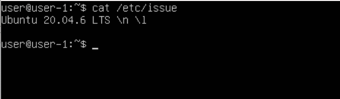

 **На сриншоте изображена версия Ubuntu.**

## Part 2. Создание пользователя

**Выполненые команды:**
- sudo adduser user1
- cat /etc/passwd

**Содержимое cat /etc/passwd:**

## Part 3. Настройка сети ОС

**Выполненые команды:**
 - hostnamectl - hostname

**Вывод hostname:**

 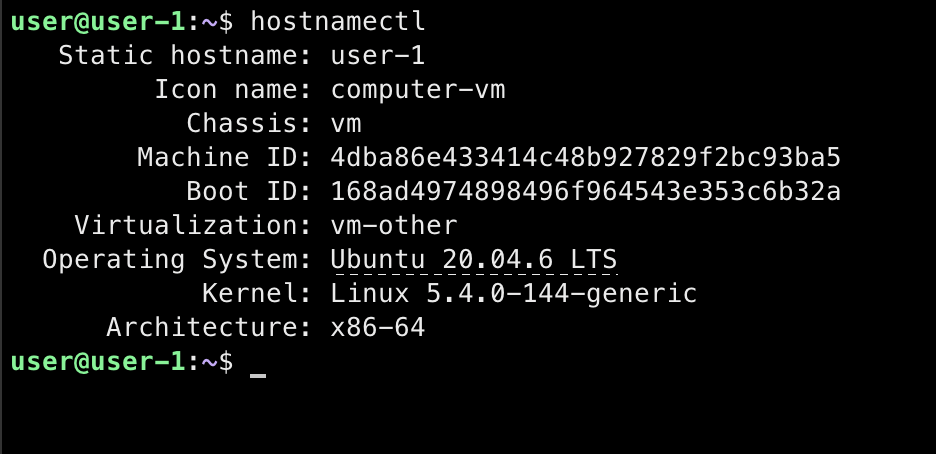

 - timedatectl - временная зона

**Вывод временой зоны:**

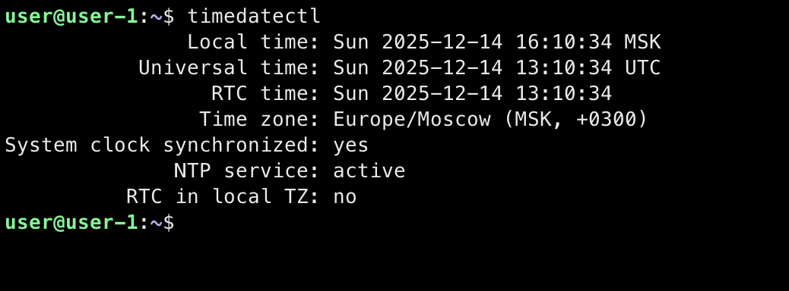

 - ip link show - интерфейсы

**Вывод сетевых интерфейсов:**

 

>Интерфейс lo (loopback) — виртуальный сетевой интерфейс, который существует в любой Linux-системе. Он используется для внутренней коммуникации системы с самой собой, имеет IP-адрес 127.0.0.1 и применяется для тестирования сетевых служб, запуска локальных серверов и отладки без необходимости физического сетевого подключения.

- sudo dhclient -v - IP от DHCP

**IP от DHCP:**

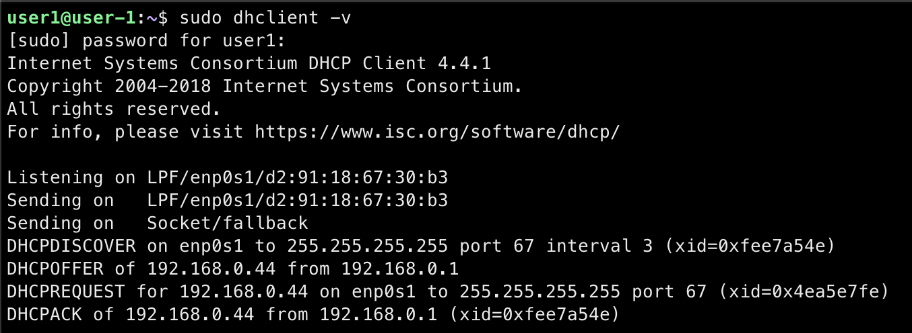

>DHCP (Dynamic Host Configuration Protocol) выполняет всю работу по подбору сетевых настроек автоматически, без необходимости присваивать вручную каждому устройству свой IP-адрес. Это очень упрощает работу системного администратора в случае расширения сети.

- ip route - Внутренний IP

**Вывод внутреннего IP:**

- curl ifconfig.me - внешний IP

**Вывод внешнего IP:**

- sudo nano /etc/netplan/01-static.yaml - прописал конфигурацию netplan
- sudo cat /etc/netplan/01-static.yaml

**Файл конфигурации netplan:**

- sudo netplan apply - применил конфигурацию netplan  
- sudo reboot - перезагрузка системы
- ip addr show enp0s1 - проверка после перезагрузки

**Проверка IP после перезагрузки:**

- resolvectl status - проверка DNS после перезагрузки

**Вывод DNS после презагрузки:**

**ping -c 10 1.1.1.1 - 0% packet loss:**

**ping -c 10 ya.ru - 0% packet loss:**

## Part 4. Обновление ОС

- sudo apt update

**Вывод после повторного обновления:**

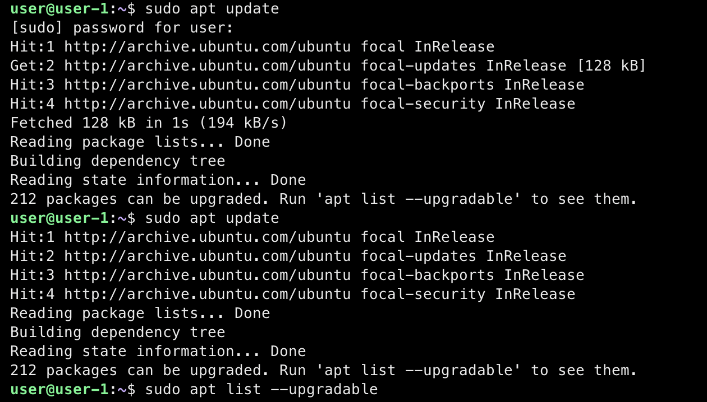

## Part 5. Использование команды sudo

>Команда sudo предназначена для контролируемого выполнения команд с привилегиями других пользователей, обычно суперпользователя (root). Она обеспечивает безопасность системы через избирательное делегирование прав, ведение логов всех действий и временное предоставление повышенных привилегий только при необходимости, следуя принципу минимальных достаточных прав.

**Изменил hostname:**

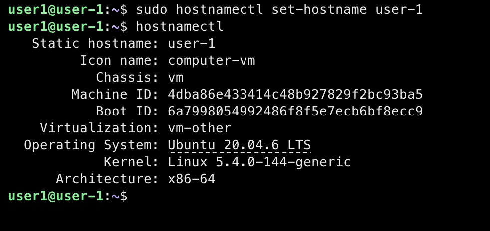

## Part 6. Установка и настройка службы времени

**Выполненые команды:**
- sudo systemctl enable systemd-timesyncd 
- sudo systemctl start systemd-timesyned 
- sudo systemctl status systemd-timesyned

**Вывод команды:**

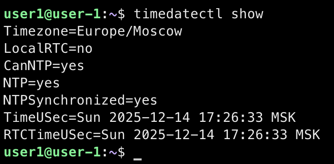

## Part 7. Установка и использование текстовых редакторов

**Выполненые команды:**
- sudo apt install nano
- sudo apt install vim
- sudo apt install mcedit

**Скриншоты после редактирования:**

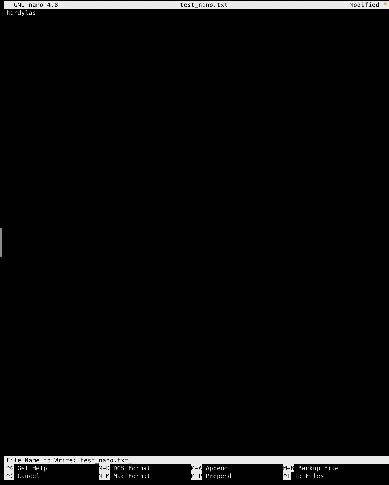
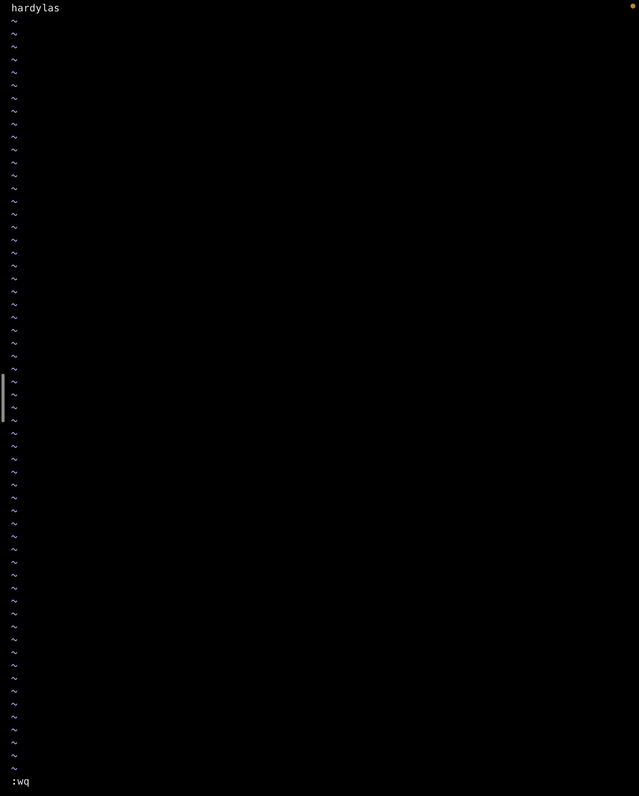
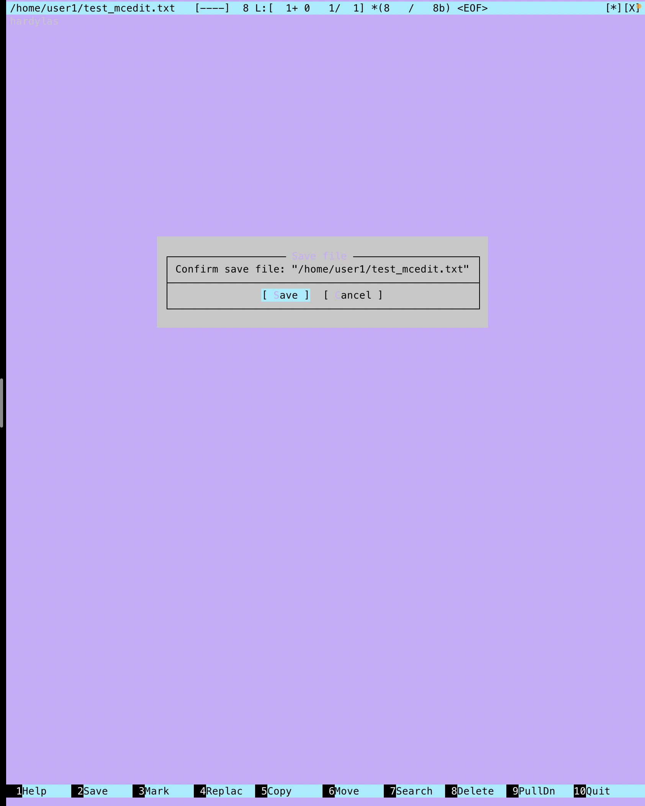

**Для выхода с сохранением изменений:**
**Nano:**
- Ctrl + O -> Enter (Для сохранения)
- Ctrl + X (Выход)

**Vim:**
- :wq (Сохранить и выйти)
- Enter

**Mcedit:**
- F2 (Сохранить)
- F10(Выйти)

**Вывод после редактирования:**
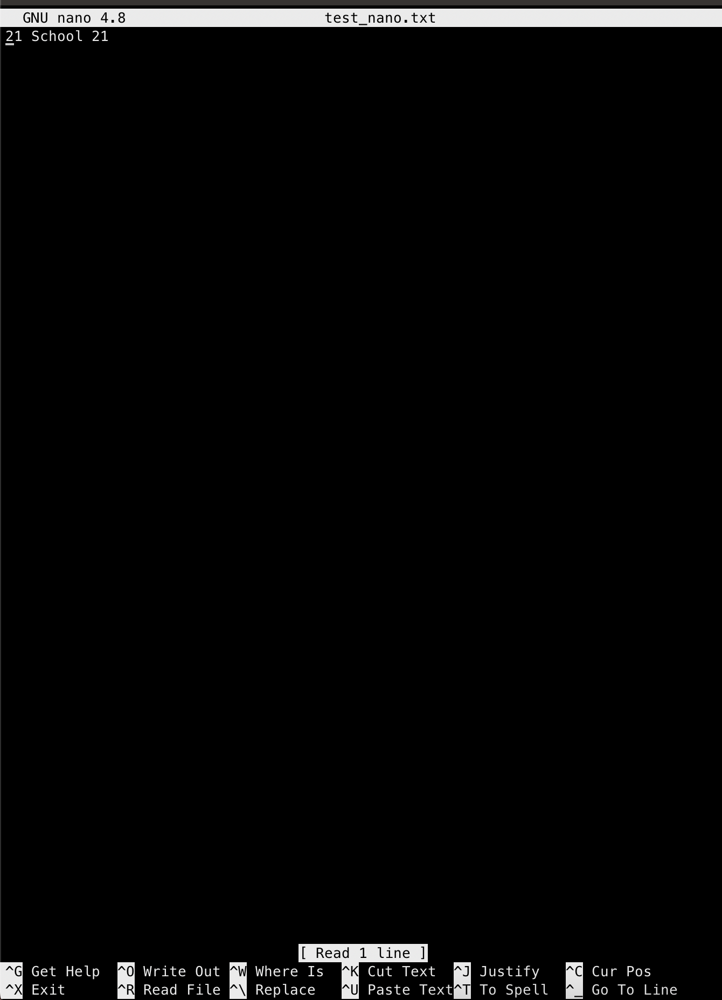
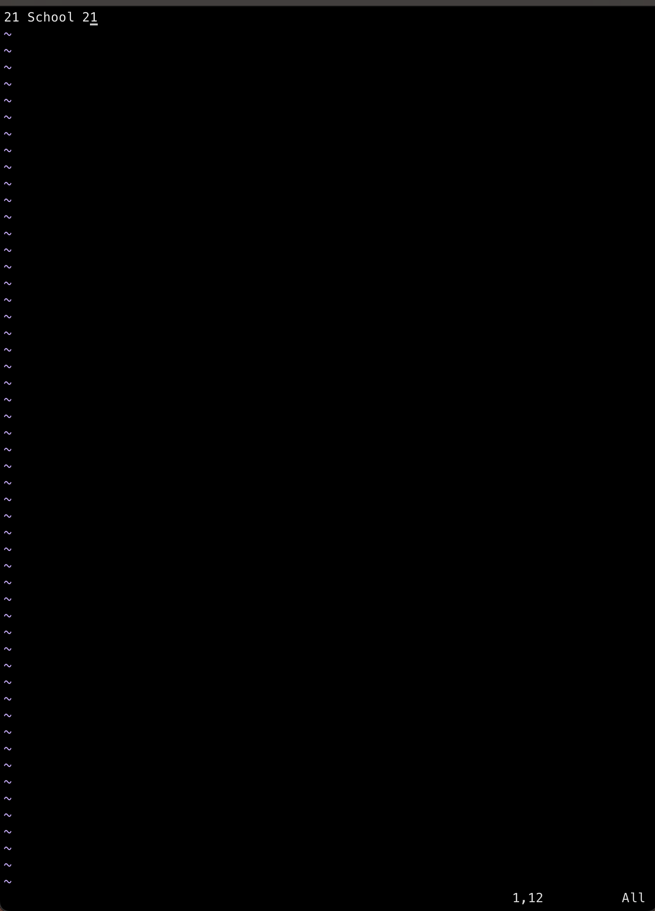
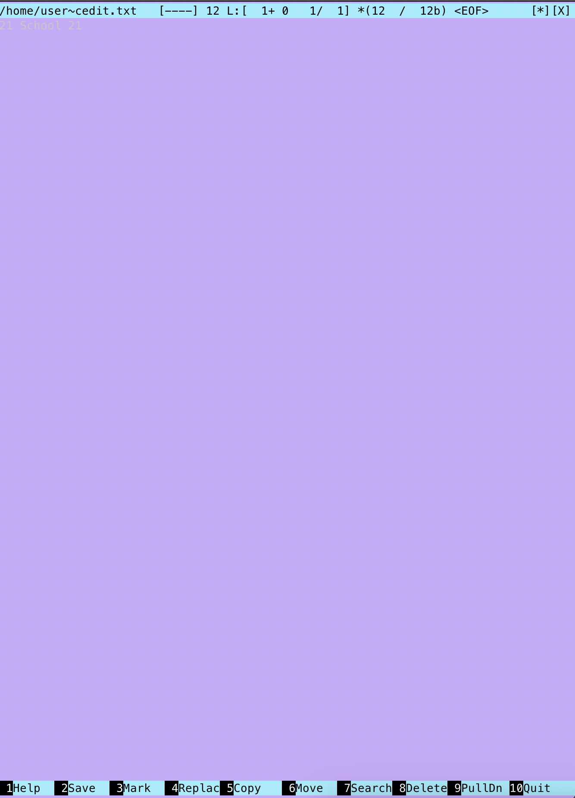

**Для выхода без сохранений:**
**Nano:**
Ctrl + X (Выход)
N(Не сохранять изменения)

**Vim:**
:q! (Выйти без сохранений)
Enter

**Mcedit:**
F10 (Выйти)
Выбать "NO" нажать Enter

**Вывод после поиска строки nano:**

**Команда:**
- Ctrl+W

**Вывод после поиска строки vim:**

**Команда:**
 - /

**Вывод после поиска строки mcedit:**

**Команда:**
- F7

**Вывод после замены строки nano:**

**Команда:**
 - Ctrl+\

**Вывод после замены строки vim:**

**Команда:**
- :%s/hardylas/21/g

**Вывод после замены строки mcedit:**

**Команда:**
- F4

## Part 8. Установка и базовая настройка сервиса SSHD

**Выполненые команды:**
- sudo apt install openssh-server -y - установка ssh сервера(-y - 
автоматически подтвержадает установку)
- sudo systemctl enable ssh - включение автоматического  запуска службы при 
запуске системы
- sudo nano /etc/ssh/sshd_config - открыть и изменить конфигурацию для 
изменения порта на 2022
- sudo systemctl restart sshd - перезапуск ssh сервера
- ps aux | grep sshd - список запущенных процессов(a - показывает процессы 
всех пользователей, u - показывает подробную информацию, x - включает  
процессы без управляющего терминала, grep sshd - оставляет только строки с 
наличием sshd)
- sudo reboot - перезагрузка системы

**Процесс установки, вывод процессов SSHD и перезагрузка системы:**

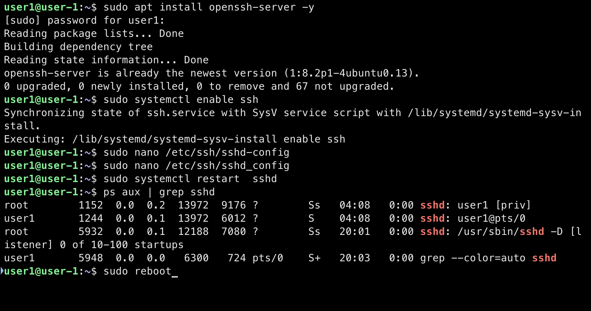

- netstat -tan | grep 2022:

**Вывод netstat:**

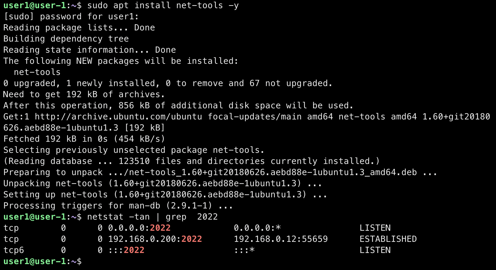

**Объяснение ключей -tan:**
-t - показывает только TCP соединения
-a - показывает все сокеты (включая слушающие)
-n - показывает числовые адреса (не преобразует в доменные имена)

**Обьяснение столбцов:**
1. протокол
2. количество байт на получение
3. количество байт на отправку
4. локальный адрес и порт
5. удаленный адрес и порт
6. состояние соединения

0.0.0.0 - означает что можно подключиться с любых ip адресов

## Part 9. Установка и использование утилит top, htop

>Команды top и htop — это интерактивные системные мониторы, которые показывают информацию о работающих процессах и использовании ресурсов в реальном времени.

top:
1. iptime: 20:49:21 up 42 min
2. users: 2 users
3. load average: 0.00, 0.00, 0.00
4. Tasks: 120 total
5. %Cpu(s): 0.0 us,  0.0 sy,  0.0 ni,100.0 id,  0.0 wa,  0.0 hi,  0.0 
si,  0.0 st
6. MiB Mem: 3919.0 total,   3136.1 free,    244.9 used,    537.9 
buff/cache
7. pid_max_mem: 1637 root
8. pid_max cpu: 566 root

htop:

**Вывод htop отсортированный по PID:**

**Вывод htop отсортированный по CPU:**

**Вывод htop отсортированный по MEMORY:**

**Вывод htop отсортированный по времени:**

**Вывод htop с добавленным выводом hostname, clock и uptime:**

## Part 10. Использование утилиты fdisk

**fdisk -l:**

- disk:
- name - /dev/vda
- size - 90 GiB
- sectors - 188743680 sectors
- swap - 3.9 GiB

## Part 11. Использование утилиты df

**df:**
- /dev/mapper/ubuntu--vg-ubuntu--lv:
- size - 44553140
- used size - 7449216
- available size - 34808324
- % used - 18%
- type of size - kilobyte(1k-blocks)

**df -Th:**
- /dev/mapper/ubuntu--vg-ubuntu--lv
- size - 43G
- used size - 7.2G
- available size - 34G
- % used - 18%\
- type files system - ext4

## Part 12. Использование утилиты du

**Вывод команды du:**

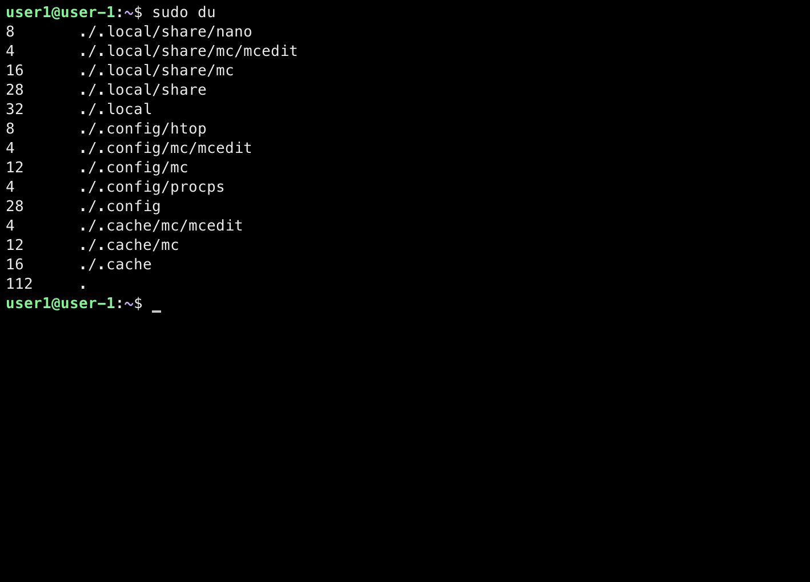

**Вывод команды du -sh для директорий:**

**Вывод команды du -sh с содержимым /var/log/*:**

## Part 13. Установка и использование утилиты ncdu

**Команда для установки:**
- sudo apt install ncdu

**Вывод команды ncdu /home:**

**Вывод команды ncdu /var:**

**Вывод команды ncdu var/log:**

## Part 14. Работа с системными журналами

**Команда:**
- sudo less /var/log/dmesg

**Содержимое /var/log/dmesg:**

**Команда:**
- sudo less /var/log/syslog

**Содержимое /var/log/syslog:**

**Команда:**
- sudo less /var/log/auth.log

**Содержимое /var/log/auth.log:**

**Команда для поиска последней авторизации:**
- sudo grep "Accepted" /var/log/auth.log

**Last auth:**
- time - Jan 17 00:22:20
- name - user-1
- method - password

**Вывод команды для поиска последней авторизации:**

**Команда для перезапуска SSHD:**
- sudo systemctl restart sshd

**Вывод статуса SSHD:**

## Part 15. Использование планировщика заданий CRON

**Выполнение команды:**
- crontab -e - открыл и написал новую команду uptime
- crontab -l - вывел список задач
- sudo grep "uptime" /var/log/syslog | tail -5 - нашел в журнале записи о выполнии задач

**Вывод списка задач CRON:**

- crontab -r - очистил список задач
- crontab -l - вывел список задач

**Вывод списка задач CRON после очистки:**

