## Part 1. Инструмент ipcalc

### 1.1. Сети и маски
 #### 1.Адрес сети 192.167.38.54/13:
   >Network:   192.160.0.0/13
  
   Комментарий: Префикс `/13` означает, что 13 бит отведены под сеть, остальные 19 бит под хосты.  
   Комментарий: Адрес сети получается побитовым AND между IP и маской; так вычисляется базовый адрес подсети.

 #### 2.Перевод масок:
  **Маска 255.255.255.0 в префиксную и двоичную запись:**

   - /24
   - 11111111.11111111.11111111.00000000
   - Комментарий: CIDR-префикс `/24` это количество единиц в маске, он быстрее читается и используется в маршрутах.

  **Маска /15 в обычную и двоичную:**

   - 255.254.0.0
   - 11111111.11111110.00000000.00000000
   - Комментарий: В маске `/15` граничный октет `254` показывает, что сеть режется не по границе байта.

  **Маска 11111111.11111111.11111111.11110000 в обычную и префиксную:**

   - 255.255.255.240
   - /28
   - Комментарий: `/28` оставляет 4 бита под хосты, поэтому в подсети 16 адресов, из них 14 пригодны для хостов.

 #### 3.Минимальный и максимальный хост в сети 12.167.38.4 при масках:**

  **Маска /8:**  

   - HostMin:   12.0.0.1
   - HostMax:   12.255.255.254
   - Комментарий: Первый и последний адрес сети зарезервированы под network и broadcast, поэтому HostMin/HostMax идут внутри диапазона.

  **Маска 11111111.11111111.00000000.00000000:**
   - HostMin:   12.167.0.1
   - HostMax:   12.167.255.254
   - Комментарий: Диапазон хостов зависит только от числа нулей в маске: чем их больше, тем больше адресов для узлов.

  **Маска 255.255.254.0:**
   - HostMin:   12.167.38.1
   - HostMax:   12.167.39.254
   - Комментарий: В `/23` сеть занимает два соседних /24 сегмента, поэтому в диапазон попадают октеты `38` и `39`.

  **Маска /4:**
   - HostMin:   0.0.0.1
   - HostMax:   15.255.255.254
   - Комментарий: При `/4` фиксируются только старшие 4 бита первого октета, из-за этого сеть очень крупная.

### 1.2. localhost**
 - **Возможность обратиться к приложению по следующим IP через localhost:**
  - 194.34.23.100 — Нет (Публичный IP, не входит в диапазон 127.0.0.0/8)
  - 127.0.0.2 — Да (входит в диапазон 127.0.0.0/8)
  - 127.1.0.1 — Да (входит в диапазон 127.0.0.0/8)
  - 128.0.0.1 — Нет (Публичный IP, не входит в диапазон 127.0.0.0/8)
 
 Комментарий: Loopback-сеть это весь диапазон `127.0.0.0/8`, а не только `127.0.0.1`.  
 Комментарий: Поэтому `127.0.0.2` и `127.1.0.1` тоже замыкаются на локальный стек хоста и не выходят в сеть.

### 1.3. Диапазоны и сегменты сетей**
- **1.Разделение IP-адресов на публичные и частные:**
  - 10.0.0.45 — Частный (входит в 10.0.0.0/8)
  - 134.43.0.2 — Публичный (не входит в частные диапазоны)
  - 192.168.4.2 — Частный (входит в 192.168.0.0/16)
  - 172.20.250.4 — Частный (входит в 172.16.0.0/12)
  - 172.0.2.1 — Публичный (172.0.0.0 не входит в 172.16.0.0/12)
  - 192.172.0.1 — Публичный (192.172.0.0 не входит в 192.168.0.0/16)
  - 172.68.0.2 — Публичный (172.68.0.0 не входит в 172.16.0.0/12)
  - 172.16.255.255 — Частный (входит в 172.16.0.0/12)
  - 10.10.10.10 — Частный (входит в 10.0.0.0/8)
  - 192.169.168.1 — Публичный (192.169.0.0 не входит в 192.168.0.0/16)
  - Комментарий: Частные диапазоны RFC1918: `10.0.0.0/8`, `172.16.0.0/12`, `192.168.0.0/16`; всё остальное считается публичным.
- **2.Определение возможных IP-адресов шлюза у сети 10.10.0.0/18:**
  - 10.0.0.1 — Нет (меньше HostMin)
  - 10.10.0.2 — Да (входит в диапазон)
  - 10.10.10.10 — Да (входит в диапазон)
  - 10.10.100.1 — Нет (больше HostMax)
  - 10.10.1.255 — Да (входит в диапазон)
  - Комментарий: Шлюз должен быть валидным хост-адресом внутри той же подсети, иначе ARP и маршрутизация не сработают.

### Итог:
- Разобраны вычисления network/broadcast/HostMin/HostMax из IP и маски через логику битовых операций.
- Показано, как читать и переводить маски в CIDR и двоичный вид.
- Разделены частные и публичные диапазоны согласно RFC1918.
- Подтверждено, что весь `127.0.0.0/8` относится к loopback.

### Типичные поломки:
- Путают `/prefix` с количеством хостов; проверка: посчитать число нулей в маске.
- Используют network/broadcast как адрес хоста; проверка: сравнить HostMin/HostMax.
- Ошибочно считают `127.0.0.1` единственным loopback; проверка: проверить любой `127.x.x.x`.
- Неверно классифицируют `172.x.x.x` как private; проверка: private только `172.16.0.0/12`.


## Part 2. Статическая маршрутизация между двумя машинами

 - **Вывод существующих интерфейсов ws1 и ws2:**

    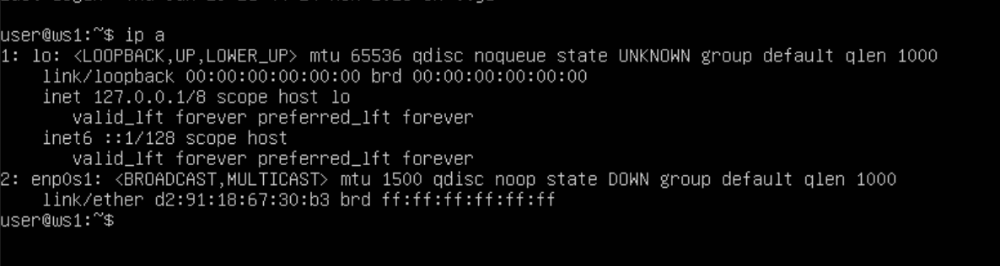
    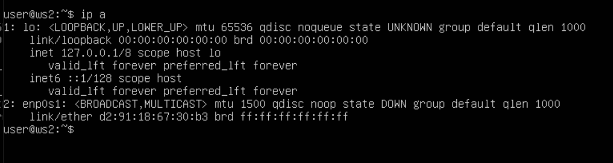
  
   Комментарий: `ip a` показывает имена интерфейсов, IPv4/IPv6 адреса и состояние link, это базовая проверка перед маршрутизацией.
 
 - **Описание сетевого интеерфейса ws1 и ws2:**

   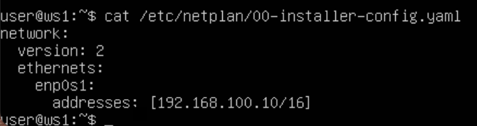
   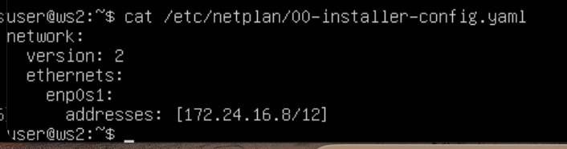
  
   Комментарий: Файл netplan фиксирует адреса и маршруты декларативно, чтобы настройки поднимались одинаково после перезагрузки.
 
 - **Команда:** sudo netplan apply
 
   Комментарий: `netplan apply` применяет YAML-конфиг к backend (`networkd`/`NetworkManager`) без ручного поднятия интерфейсов.

 - **Вывод интерфейсов после выполнеения команды ws1 и ws2:**

   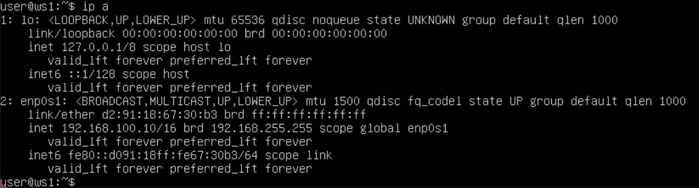
   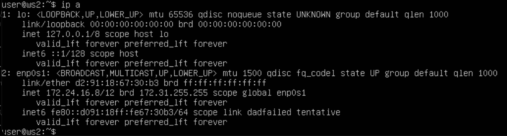
  
   Комментарий: Ожидаемый эффект - адреса и состояния интерфейсов соответствуют заданному плану, без `tentative`/`down`.

 ### 2.1. Добавление статического маршрута вручную
  - **Добавление маршрутов вручную командой sudo ip route add и проверка добавления нового ip:**

    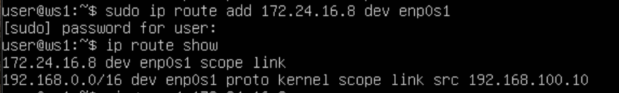
    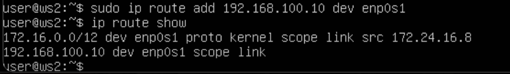
    
    Комментарий: Таблица маршрутизации определяет, через какой next-hop отправлять пакет в конкретную сеть; смотреть её удобно через `ip r`.
    Комментарий: Маршруты, добавленные `ip route add`, живут только в runtime и пропадают после reboot/перезапуска сети.

  - **Ping ws1 на ws2 и в обратную сторону:**

    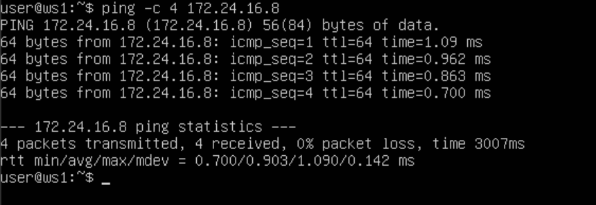
    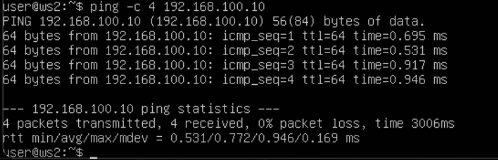
    
    Комментарий: Успешный двусторонний ping подтверждает, что есть как прямой, так и обратный маршрут.

 ### 2.2. Добавление статического маршрута с сохранением
  - **Содержание файла /etc/netplan/00-installer-config.yaml после изменения в ws1 и ws2:**

    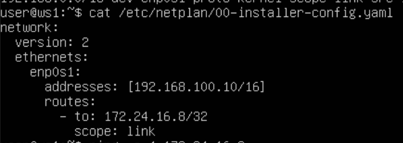
    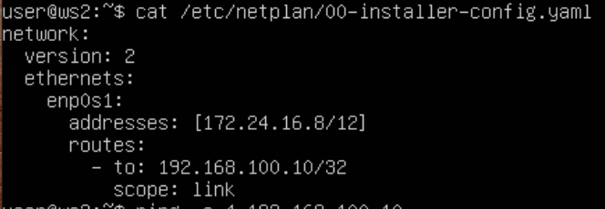
    
    Комментарий: Маршруты через netplan становятся постоянными, потому что заново генерируются и поднимаются при старте системы.

  - **Ping ws1 на ws2 и в обратную сторону:**
  
    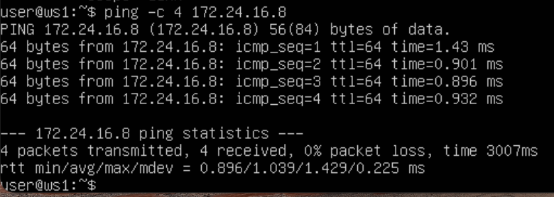
    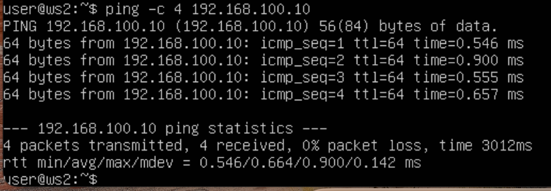
    
    Комментарий: Повторная проверка после переноса в netplan подтверждает, что связность не зависит от временных команд.

### Итог:
- Проверены интерфейсы и применена адресация через netplan.
- Добавлены статические маршруты вручную и подтверждена связность между ws1/ws2.
- Показана разница между временными маршрутами (`ip route add`) и постоянными (через YAML netplan).
- Контроль состояния выполнен через `ip a`, `ip r` и ping в обе стороны.

### Типичные поломки:
- Ошибка в имени интерфейса в netplan; проверка: `ip a` и `netplan try`.
- Не выполнен `netplan apply`; проверка: адреса/маршруты не меняются в `ip a` и `ip r`.
- Добавлен только прямой маршрут без обратного; проверка: ping работает только в одну сторону.
- Ожидают сохранение маршрута после `ip route add`; проверка: после reboot запись исчезает из `ip r`.

## Part 3. Утилита iperf3
 ### 3.1. Скорость соединения
  #### Перевод единиц
   - **8 Mbps в MB/s:**
       8 Mbps ÷ 8 = 1 MB/
      Комментарий: Деление на 8 нужно, потому что `B` (байт) = 8 бит (`b`).

   - **s100 MB/s в Kbps:**
       100 MB/s × 8 = 800 Mbps 800 Mbps × 1000 = 800 000 Kbps
      Комментарий: При переводе между M и K в сетевых задачах обычно используется десятичный множитель 1000.

   - **1 Gbps в Mbps:**
       1 Gbps × 1000 = 1000 Mbps
      Комментарий: Единицы в отчётах iperf3 чаще всего в битах/сек, важно не путать с байтами/сек.

  ### 3.2. Утилита iperf3
   #### Установка iperf3:
   > **Команда:** sudo apt install iperf3 -y
   
   Комментарий: Утилита нужна для активного измерения пропускной способности канала при передаче тестового трафика.
    

   #### Измерение скорости команда и вывод команд ws1(server), ws2(client):
   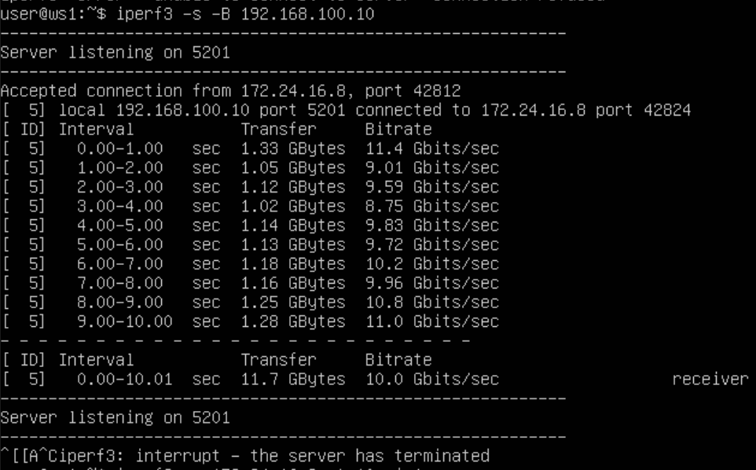
   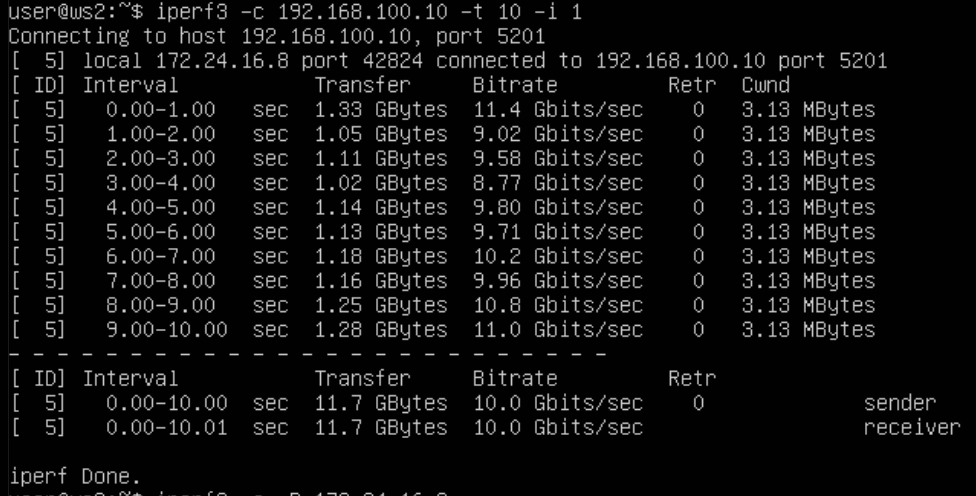
   
   Комментарий: В связке `iperf3 -s`/`iperf3 -c` сервер только принимает, клиент генерирует поток и замеряет throughput.


   >**Результат скорости:** 10.0 Gbits/sec
   
   Комментарий: Значение близко к физическому пределу 10G, значит узких мест на этом участке почти нет.


   #### Измерение скорости команда и вывод команд ws1(client), ws2(server):
   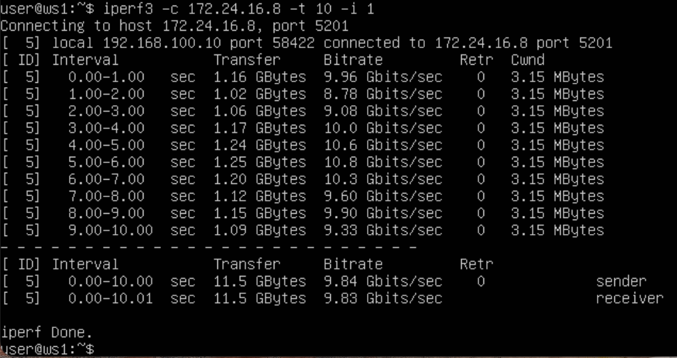
   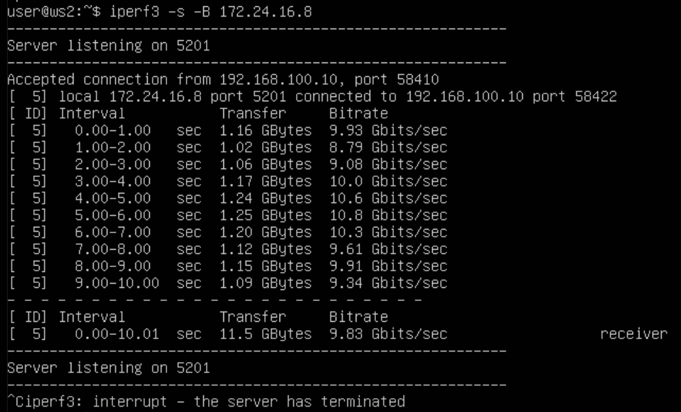
   
   Комментарий: Запуск в обратном направлении проверяет асимметрию канала и корректность обоих сетевых стеков.

   >**Результат скорости:** 9.83 Gbits/sec
   
   Комментарий: `ping` измеряет задержку и доступность, но не заменяет iperf3, потому что не нагружает канал длительным потоком данных.

### Итог:
- Выполнен перевод сетевых единиц между `K/M/G` и `bit/byte`.
- Поднята классическая схема теста: `ws1/ws2` в ролях server/client и наоборот.
- Измерена фактическая пропускная способность (throughput) в обоих направлениях.
- Подтверждено, что оценка bandwidth требует iperf3, а не только ping.

### Типичные поломки:
- Путают `Mbps` и `MB/s`; проверка: помнить деление/умножение на 8.
- Не запущен сервер iperf3 перед клиентом; проверка: ошибка подключения на `iperf3 -c`.
- Тестируют только одно направление; проверка: запустить client/server в обе стороны.
- Делают вывод о полосе только по ping; проверка: сравнить ping и iperf3 результаты.

## Part 4. Сетевой экран
 ### 4.1. Утилита iptables
  
  - **Создал файл sudo nano /etc/firewall.sh на ws1 и ws2**
   > - Удаление всех правил в таблице «filter»
   > - Разрешение доступа к порту 22 (SSH) и 80 (HTTP)
   > - Разрешение echo reply(будет пинговаться) и запрет echo reply(не будет пинговаться) - на ws2 в обратном порядке

   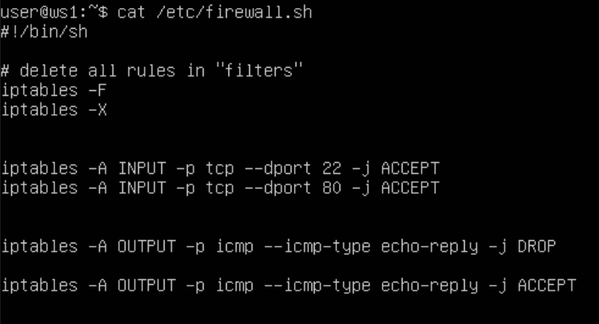
   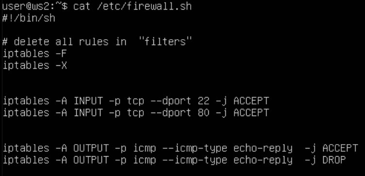
   
   Комментарий: `iptables` управляет подсистемой Netfilter в ядре Linux, то есть фильтрация происходит на уровне ядра до приложения.
   Комментарий: В таблице `filter` цепочка `INPUT` фильтрует входящее на хост, `OUTPUT` исходящее с хоста, `FORWARD` транзит через хост.
  
  - **Выполнил команды:**
   - sudo chmod +x /etc/firewall.sh (сделал файл исполняемым)
   - sudo /etc/firewall.sh (запустил файл)
   - sudo iptables -L -n -v (проверил применились ли правила)
   - Комментарий: `iptables -F` очищает правила в цепочках, `iptables -X` удаляет пользовательские цепочки; это нужно для чистого старта.
   - Комментарий: Правила обрабатываются сверху вниз до первого совпадения, поэтому порядок `DROP/ACCEPT` принципиален.
  
  **Команды и вывод на скриншотах:**
   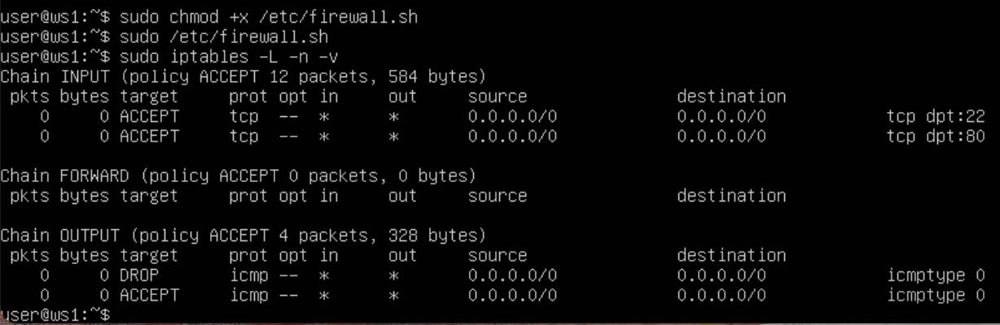
   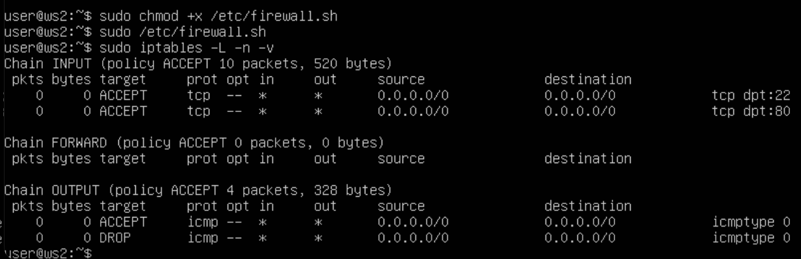

  > **Разница между двумя стратериями:**
  > - **ws1 (запрет → разрешение):** Более безопасная стратегия. Первое правило DROP блокирует все echo-reply пакеты, второе правило ACCEPT никогда не достигается.
  > - **ws2 (разрешение → запрет):** Более гибкая стратегия. Первое правило ACCEPT разрешает echo-reply, второе правило DROP игнорируется для уже разрешенных пакетов.
  > Комментарий: Echo-reply блокируется именно в `OUTPUT`, потому что ответ на ping формирует и отправляет сама машина.
  > Комментарий: Порты `22` и `80` открываются отдельно, чтобы сохранить SSH-доступ и проверить HTTP независимо от ICMP.
 
 ### 4.2. Утилита nmap
  
  - **Ping ws1 -> ws2 и ws2 -> ws1:**

   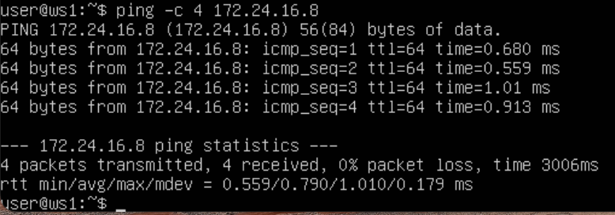
   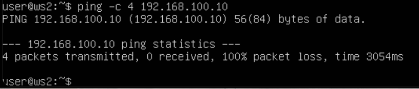

   >**Результат:**
     ws1 не пингуется с ws2
   
   Комментарий: Запрет ICMP не означает полную недоступность хоста, он только отключает конкретный тип диагностического трафика.


  - **nmap ws2 -> ws1:**

   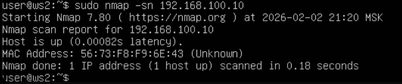
   > **Показывает:** Host is up
   
   Комментарий: `nmap` может определить host up по TCP-ответам, даже когда ICMP Echo Request/Reply заблокированы firewall.

### Итог:
- Настроены и применены правила iptables на ws1/ws2 с разным порядком `DROP/ACCEPT`.
- Проверено влияние порядка правил в цепочках Netfilter при обработке сверху вниз.
- Отдельно сохранён доступ по `22/tcp` и `80/tcp`, а ICMP управляется отдельными правилами.
- Сравнение ping и nmap показало, что блок ICMP не равен “хост выключен”.

### Типичные поломки:
- Применяют новые правила поверх старых; проверка: предварительно `iptables -F` и при необходимости `iptables -X`.
- Перепутана цепочка (`INPUT`/`OUTPUT`/`FORWARD`); проверка: смотреть направление трафика.
- Неверный порядок правил; проверка: `iptables -L -n -v --line-numbers`.
- Закрывают `22/tcp` и теряют удалённый доступ; проверка: сначала добавить ACCEPT для SSH.

## Part 5. Статическая маршрутизация сети

 ### 5.1. Настройка адресов машин

 - **Поднял 5 виртуальных машин:**
   - 3 рабочие станции: ws11, ws21, ws22
   - 2 маршрутизатора: r1, r2

 - **Настроил статические IP-адреса на всех машинах в файле `/etc/netplan/01-static.yaml` согласно схеме сети**

   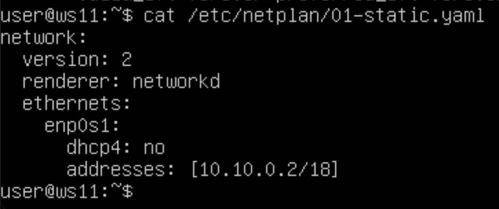
   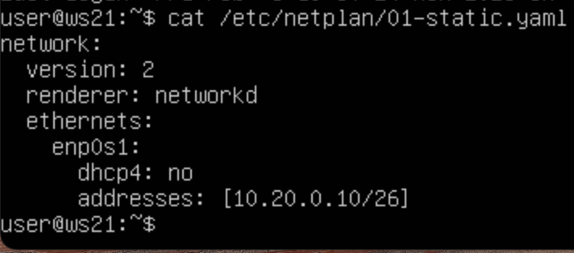
   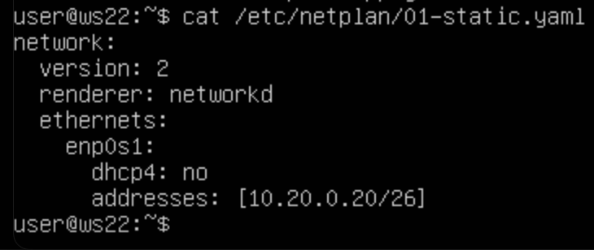
   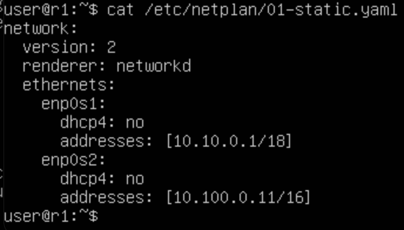
   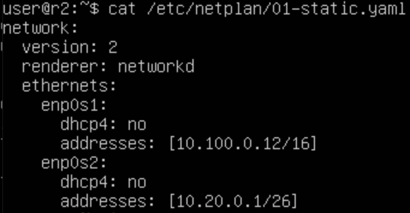
  
   Комментарий: В netplan задаются адрес, префикс и шлюз интерфейса; это база для корректной маршрутизации между сегментами.

 - **Применил конфигурацию сети:**
   - sudo netplan apply
   - Комментарий: Без применения конфиг остаётся только в файле и не попадает в активную конфигурацию ядра.

 - **Проверил, что IP-адреса заданы корректно:**
   - ip -4 a
   - Комментарий: `ip -4 a` выводит только IPv4, поэтому легче проверить именно адресацию из схемы лаборатории.

   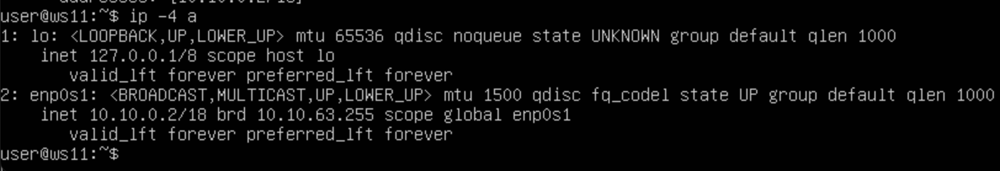
   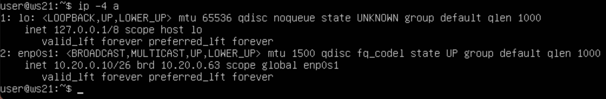
   
   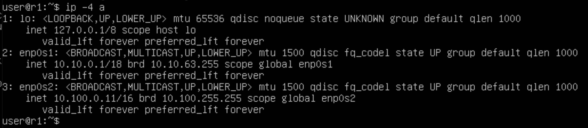
   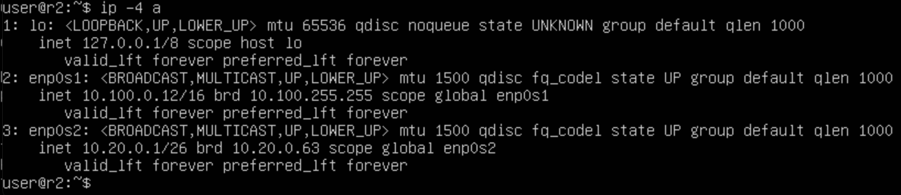

 - **Проверил сетевую связность:**
   - ping ws22 с ws21
   - ping r1 с ws11
   - Комментарий: Проверка соседних узлов подтверждает, что L2/L3 на каждом локальном сегменте работают до настройки транзитных маршрутов.

   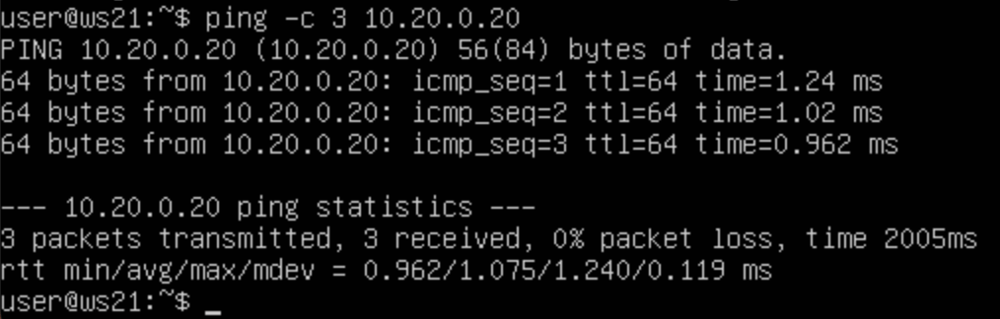
   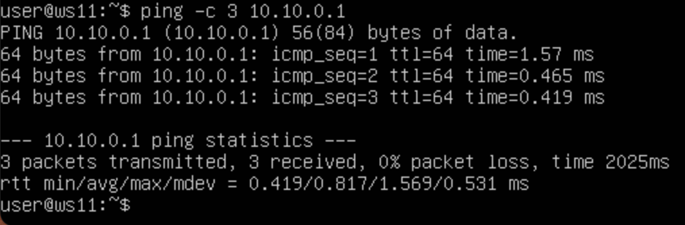

---

 ### 5.2. Включение переадресации IP-адресов

  - **Включил IP forwarding на маршрутизаторах r1 и r2 (временно):**
   - sysctl -w net.ipv4.ip_forward=1
   - Комментарий: Эта команда включает маршрутизацию в ядре до перезагрузки, чтобы хост начал пересылать пакеты между интерфейсами.

   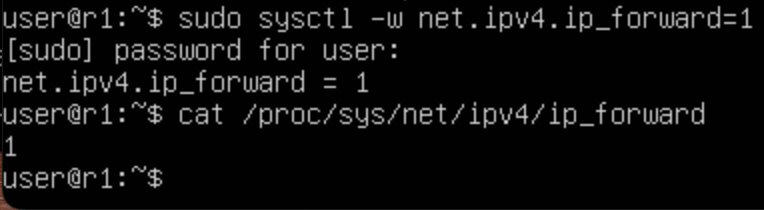
   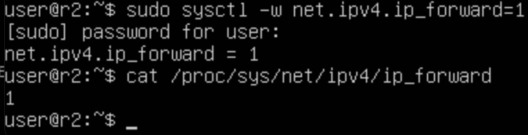

  - **Включил IP forwarding на постоянной основе:**
   - добавил строку `net.ipv4.ip_forward = 1` в файл `/etc/sysctl.conf`
   - Комментарий: Изменение в `/etc/sysctl.conf` делает параметр постоянным, он применяется при старте системы.
  
   **sysctl.conf в r1**

   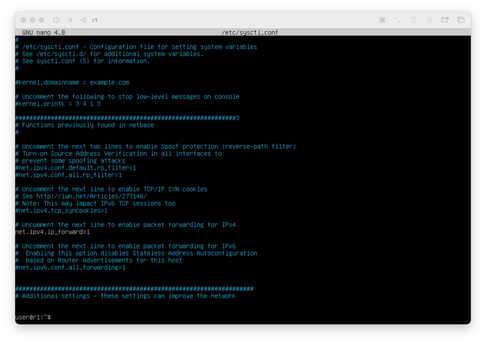

   **Результат применения r1:**

   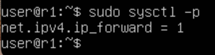
   
   Комментарий: Ожидаемый признак успеха - значение `net.ipv4.ip_forward = 1` в выводе `sysctl`.

   **sysctl.conf в r1**

   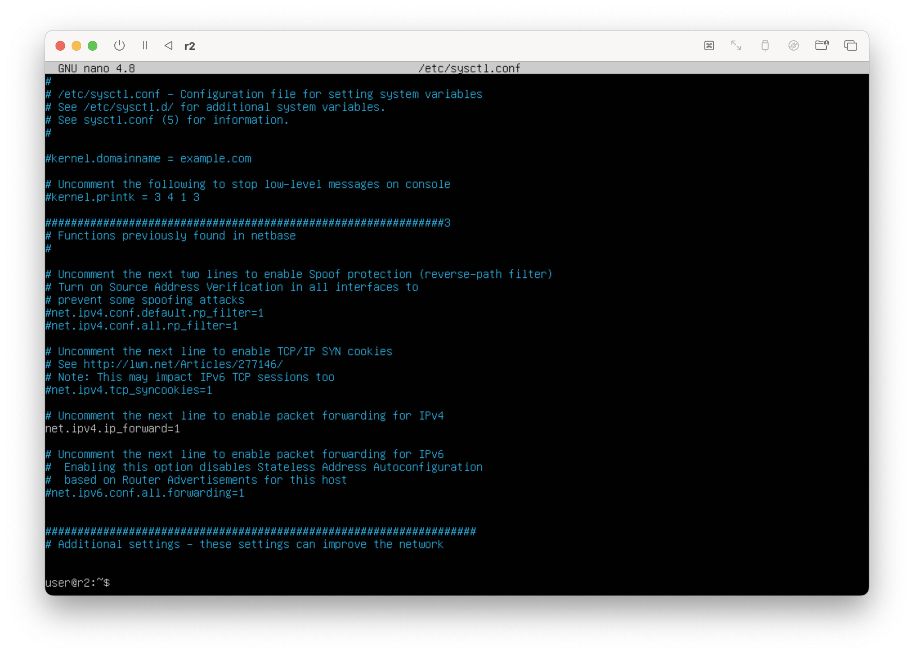

   **Результат применения r1:**

   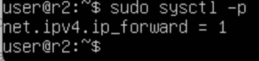


 ### 5.3. Установка маршрута по умолчанию

  - **Настроил маршрут по умолчанию на рабочей станции ws11 через маршрутизатор r1**
   - добавил default route в файл `/etc/netplan/01-static.yaml`
   - Комментарий: Default route используется для всех сетей, для которых нет более специфичных записей в таблице маршрутизации.

   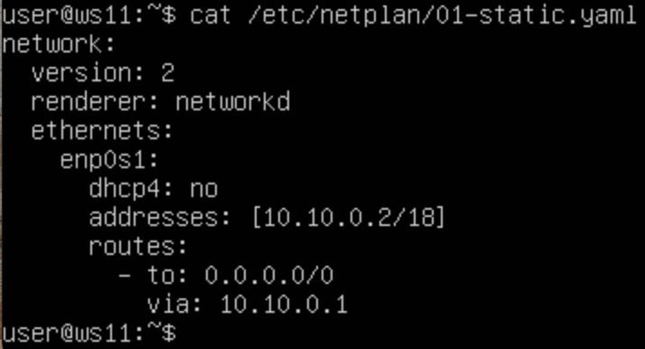
   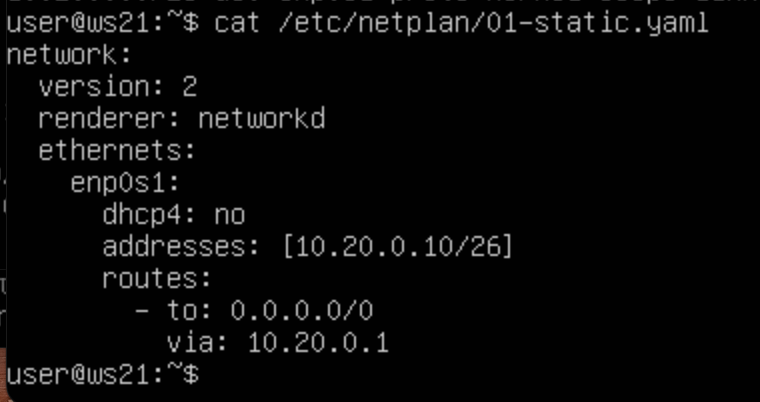
   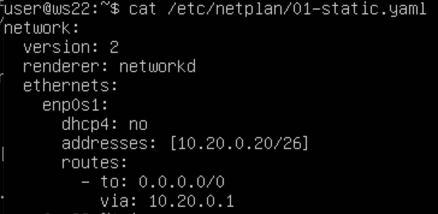

  - **Применил конфигурацию сети на ws11, ws21, ws22:**
   - sudo netplan apply

  - **Проверил наличие маршрута по умолчанию:**
   - ip r
   - Комментарий: В `ip r` маршрут по умолчанию виден как `default via <gateway> dev <iface>`.

   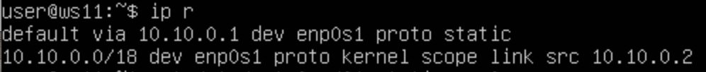
   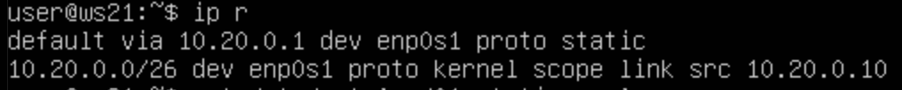
   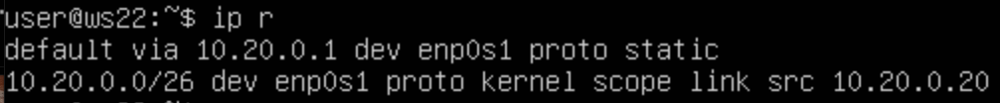

  - **Пропинговал маршрутизатор r2 с ws11**
  
   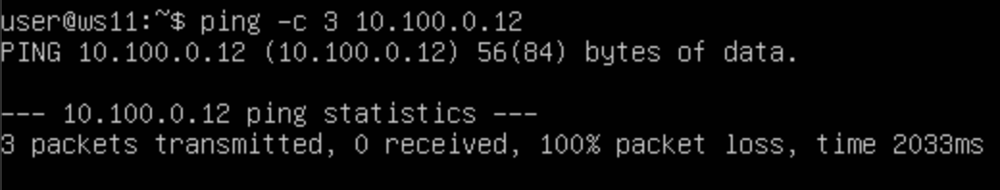
   
   Комментарий: Пакет с ws11 уходит на r1 как на шлюз, а r1 уже решает следующий hop до r2 по своей таблице маршрутов.

  - **На маршрутизаторе r2 запустил перехват ICMP-трафика:**
   - sudo tcpdump -tn -i enp0s1 icmp
   - Комментарий: `-t` убирает timestamp, `-n` отключает DNS-резолв, `-i` выбирает интерфейс; так проще анализировать маршрут в “сыром” виде.

   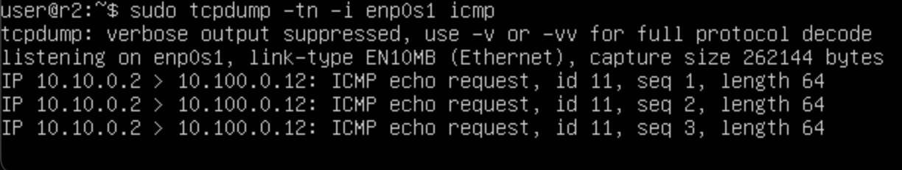

   > **Результат:**  
   > В выводе tcpdump зафиксированы ICMP echo-запросы от ws11, что подтверждает корректную работу маршрута по умолчанию.
 
 ### 5.4. Добавление статических маршрутов

  - **Добавил статический маршрут на маршрутизаторе r1**
   - в сеть 10.20.0.0/26 через r2 (10.100.0.12)
   - добавил маршрут в файл `/etc/netplan/01-static.yaml` в описание интерфейса, подключённого к сети 10.100.0.0/16

   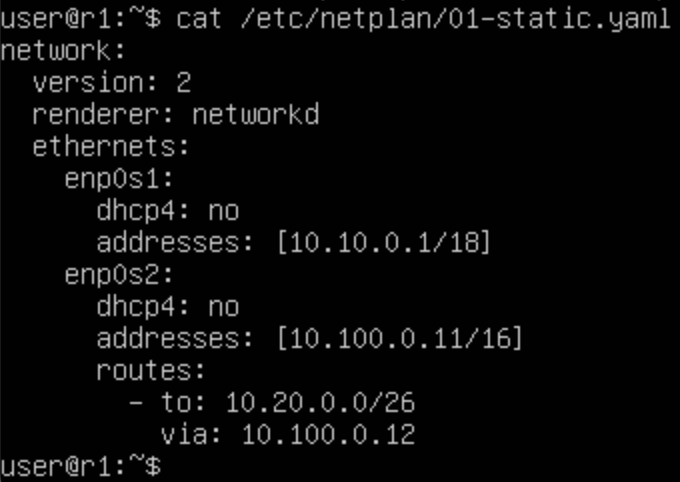

  - **Добавил статический маршрут на маршрутизаторе r2**
   - в сеть 10.10.0.0/18 через r1 (10.100.0.11)
   - добавил маршрут в файл `/etc/netplan/01-static.yaml` в описание интерфейса, подключённого к сети 10.100.0.0/16

   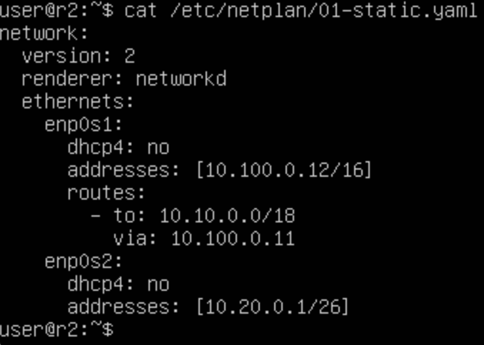

  - **Применил изменения конфигурации сети**
   - sudo netplan apply

  - **Проверил таблицы маршрутизации на r1 и r2**
   - ip r

   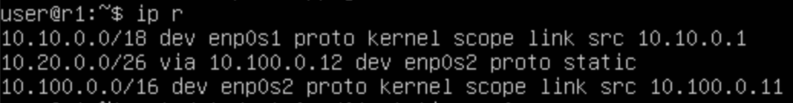
   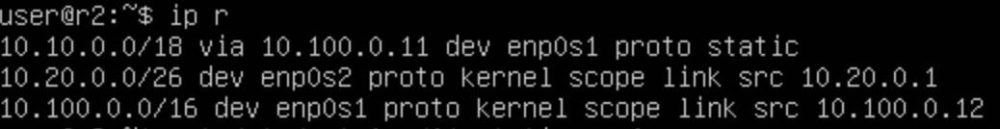

  > **Результат:**  
  > На r1 появился маршрут в сеть 10.20.0.0/26 через 10.100.0.12.  
  > На r2 появился маршрут в сеть 10.10.0.0/18 через 10.100.0.11.

  - **Проверил маршруты на рабочей станции ws11**
   - ip r list 10.10.0.0/18
   - ip r list 0.0.0.0/0

   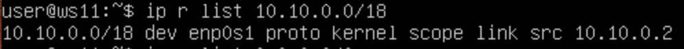
   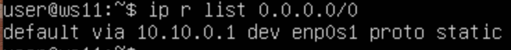

  > **Почему выбран маршрут 10.10.0.0/18, а не 0.0.0.0/0:**  
  > В Linux используется правило Longest Prefix Match.  
  > Маршрут 10.10.0.0/18 является более специфичным (длинный префикс), чем маршрут по умолчанию 0.0.0.0/0.  
  > Поэтому система выбирает именно его, даже несмотря на наличие default-маршрута.

 ### 5.5. Построение списка маршрутизаторов

  - **Запустил перехват сетевого трафика на маршрутизаторе r1**
   - sudo tcpdump -tnv -i enp0s1

   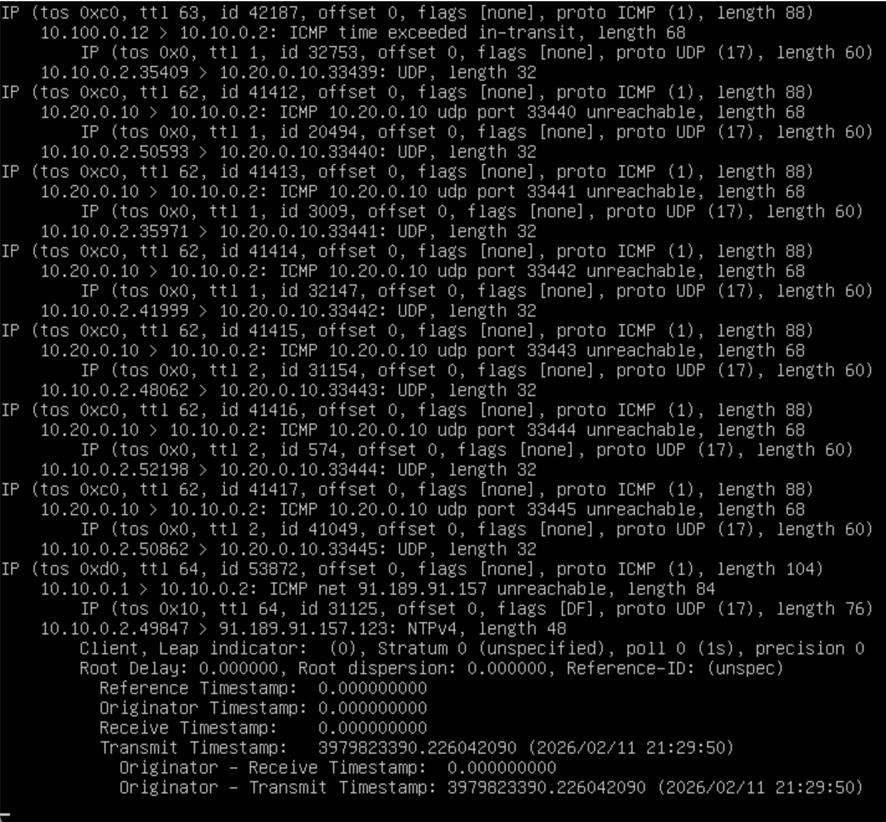

  - **Выполнил трассировку маршрута с рабочей станции ws11 до ws21**
   - traceroute 10.20.0.10
   - Комментарий: traceroute повышает TTL по шагам, поэтому каждый промежуточный роутер отвечает ICMP Time Exceeded и попадает в список hop.

   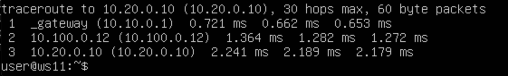

  > **Результат:**  
  > 1. 10.10.0.1 — маршрутизатор r1  
  > 2. 10.100.0.12 — маршрутизатор r2  
  > 3. 10.20.0.10 — рабочая станция ws21  

 - **Объяснение принципа работы traceroute**

  > Утилита traceroute отправляет UDP-пакеты с постепенно увеличивающимся значением TTL (Time To Live).  
  > Каждый маршрутизатор уменьшает TTL на 1.  
  > Когда TTL становится равным 0, маршрутизатор отбрасывает пакет и отправляет ICMP-сообщение "Time Exceeded".  
  > По этим ICMP-ответам определяется последовательность маршрутизаторов на пути следования пакета.  
  > В выводе tcpdump на r1 видно прохождение UDP-пакетов от 10.10.0.2 к 10.20.0.10 и ответы ICMP, что подтверждает участие r1 в маршрутизации.

 ### 5.6. Использование протокола ICMP при маршрутизации

  - **Запустил перехват ICMP-трафика на маршрутизаторе r1**
   - sudo tcpdump -n -i enp0s1 icmp

   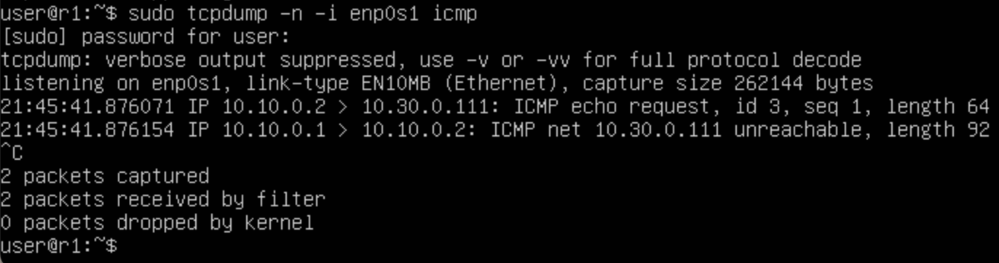

  - **Выполнил пинг несуществующего IP-адреса с ws11**
   - ping -c 1 10.30.0.111
   - Комментарий: Для несуществующей/недостижимой сети ожидается ICMP Destination Unreachable от ближайшего узла, который не знает маршрут.

   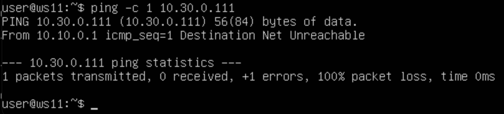

  > **Результат:**  
  > В tcpdump наблюдается отправка ICMP Echo Request от 10.10.0.2  
  > и ICMP-сообщение Destination Unreachable в ответ.  
  > Это подтверждает использование протокола ICMP для уведомления об ошибке маршрутизации.

### Итог:
- Назначены IPv4-адреса, включён `ip_forward` и настроены default/static маршруты на узлах и роутерах.
- Подтверждена работа таблиц маршрутизации через `ip r` и выбор next-hop по правилу Longest Prefix Match.
- Через `tcpdump` и `traceroute` зафиксирован реальный путь пакетов между сегментами.
- Показано ICMP-уведомление об ошибке маршрута при обращении к несуществующей сети.

### Типичные поломки:
- Не включён `net.ipv4.ip_forward`; проверка: `sysctl net.ipv4.ip_forward`.
- Ошибка default gateway на хосте; проверка: `ip r` и ping шлюза.
- Статический маршрут добавлен не на том интерфейсе; проверка: `ip r` на r1/r2.
- Запуск tcpdump на неверном интерфейсе; проверка: сверить имя интерфейса через `ip a`.

## Part 6. Динамическая настройка IP с помощью DHCP

 ### 6.1. Настройка DHCP-сервера на r2

  - Установил DHCP-сервер:
    - sudo apt install isc-dhcp-server

  - Настроил файл /etc/dhcp/dhcpd.conf:

```bash
# subnet: описание подсети, для которой dhcpd выдаёт параметры
subnet 10.100.0.0 netmask 255.255.0.0 {}

# range: пул адресов для динамической выдачи клиентам
subnet 10.20.0.0 netmask 255.255.255.192 {
  range 10.20.0.2 10.20.0.50;
  # option routers: шлюз по умолчанию для клиентов подсети
  option routers 10.20.0.1;
  # option domain-name-servers: DNS, который получит клиент по DHCP
  option domain-name-servers 10.20.0.1;
}
```

 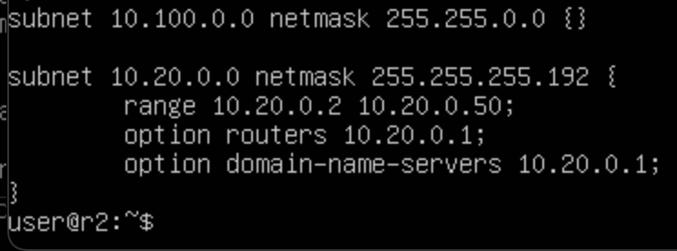

  - Прописал DNS в /etc/resolv.conf:

   nameserver 8.8.8.8
  
   Комментарий: `resolv.conf` задаёт DNS-резолвер самого сервера; это важно для проверки внешних имён и сервисов.

 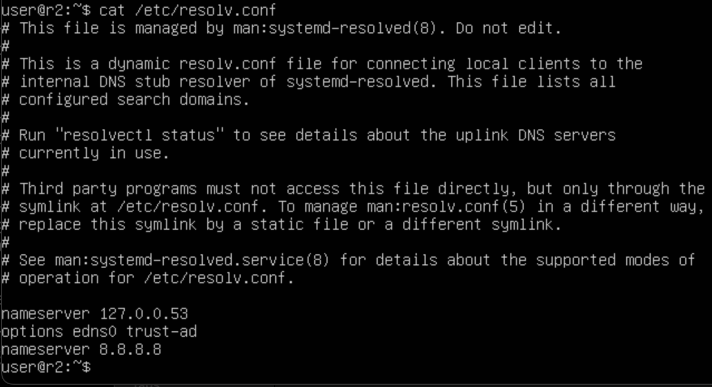

  - Перезапустил службу DHCP:

   - sudo systemctl restart isc-dhcp-server
   - sudo systemctl status isc-dhcp-server --no-pager
   - Комментарий: `restart` перечитывает новую конфигурацию, `status` подтверждает, что сервис поднялся без синтаксических ошибок.

 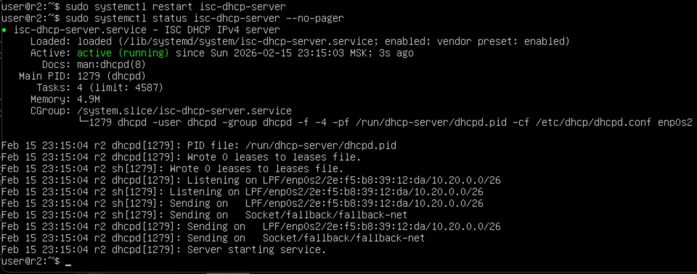


 ### 6.2. Получение IP по DHCP на ws21

  - Настроил netplan:

```bash
network:
  # версия схемы netplan
  version: 2
  # backend управления интерфейсами
  renderer: networkd
  ethernets:
    enp0s1:
     # включение DHCP для IPv4
     dhcp4: true
```

 - Применил конфигурацию:
   - sudo netplan apply
   - sudo reboot
   - Комментарий: После перезапуска клиент заново запрашивает lease и получает параметры сети с DHCP-сервера.

 - Проверил получение IP:
   - ip a
   - Комментарий: Признак успеха - адрес интерфейса попал в диапазон `range`, а не остался статическим/старым.

 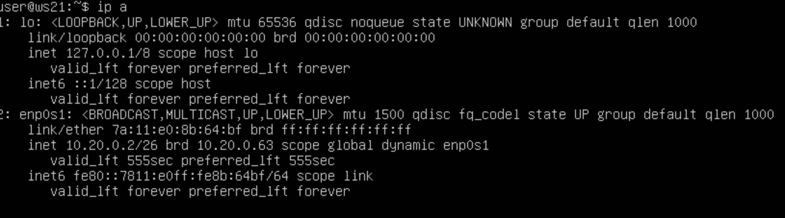

 - Проверил соединение с ws22:
   - ping 10.20.0.X
   - Комментарий: Это подтверждает, что клиент получил не только IP, но и корректный маршрут внутри подсети.

 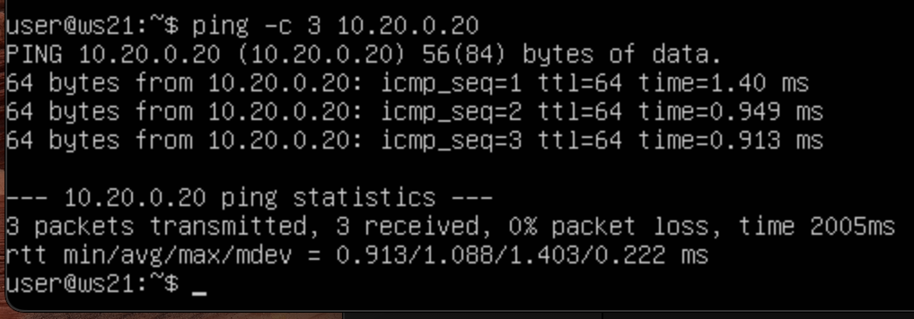


 ### 6.3. Жёсткая привязка IP по MAC (ws11)

  - Изменил netplan на ws11:

```bash
network:
  version: 2
  renderer: networkd
  ethernets:
    enp0s1:
      # MAC фиксируется, чтобы reservation на DHCP выдавал нужный адрес
      macaddress: 10:10:10:10:10:BA
      # адрес получает по DHCP, но по закреплению на сервере
      dhcp4: true
```

 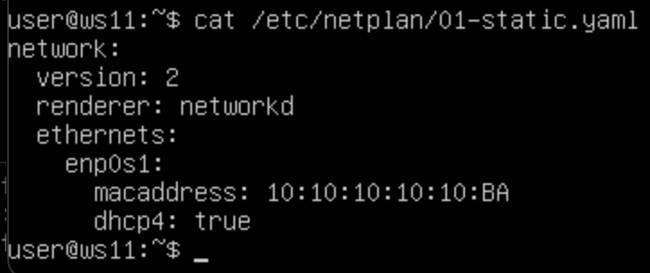

  - Настроил DHCP на r1:

  - Настроил DHCP на r1:

```bash
subnet 10.10.0.0 netmask 255.255.192.0 {
    option routers 10.10.0.1;
    option domain-name-servers 10.10.0.1;

    host ws11 {
        # reservation: выдача по MAC конкретному клиенту
        hardware ethernet 10:10:10:10:10:BA;
        # fixed-address: всегда один и тот же IP для этого MAC
        fixed-address 10.10.0.2;
    }
}
```

 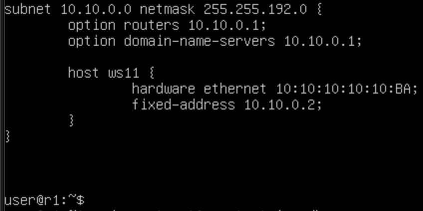

  - Обновил IP:
   - sudo dhclient -r enp0s1
   - sudo dhclient enp0s1
   - ip a
   - Комментарий: `dhclient -r` отдаёт текущий lease, затем новый запрос запускает цикл DORA и получает обновлённую аренду.

 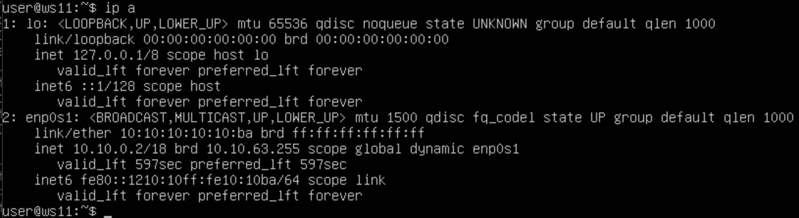


 ### 6.4. Обновление IP на ws21

  - IP до обновления:
   - ip a

 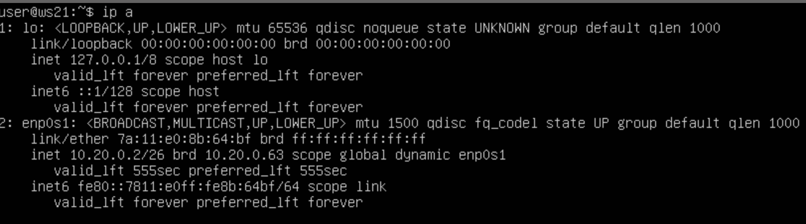

 - Освободил и повторно запросил адрес:
   - sudo dhclient -r enp0s1
   - sudo dhclient enp0s1
   - Комментарий: До/после видно, изменился ли IP и срок аренды; это проверка реальной работы DHCP, а не только конфига.

  - IP после обновления:
   - ip a

 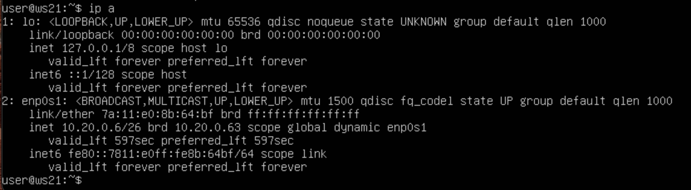

 - Использованные опции DHCP-сервера:
   - range(Определяет диапазон IP-адресов, которые DHCP-сервер может выдавать клиентам автоматически.)
   - option routers(Указывает шлюз по умолчанию (default gateway), который будет передан клиенту.)
   - option domain-name-servers(Определяет DNS-сервер, который будет использовать клиент для разрешения доменных имён.)
   - hardware ethernet(Указывает MAC-адрес конкретного клиента в блоке host.)
   - fixed-address(Закрепляет конкретный IP-адрес за указанным MAC-адресом.)
 
 Комментарий: Выдача IP клиенту проходит DORA-цикл (Discover, Offer, Request, Ack), и на каждом шаге согласуются адрес и сетевые опции.

### Итог:
- Настроен DHCP-сервер с пулом адресов, шлюзом и DNS-параметрами для клиентов.
- Клиент ws21 переведён на автоматическое получение IP и успешно получил lease.
- Для ws11 настроено reservation: один MAC всегда получает один фиксированный адрес.
- Через `dhclient` проверено обновление аренды и изменение состояния до/после.

### Типичные поломки:
- Ошибка синтаксиса в `dhcpd.conf`; проверка: `systemctl status isc-dhcp-server`.
- Клиент остаётся со старым статическим IP; проверка: netplan и `ip a`.
- Неверный MAC в reservation; проверка: `ip link` и сравнение `hardware ethernet`.
- Не обновлён lease после правок; проверка: `dhclient -r` и `dhclient`.

## Part 7. NAT

 ### 7.1 Настройка Apache

  - Изменил файл `/etc/apache2/ports.conf` на ws22 и r1  
   Заменил строку: Listen 80
   на: Listen 0.0.0.0:80

 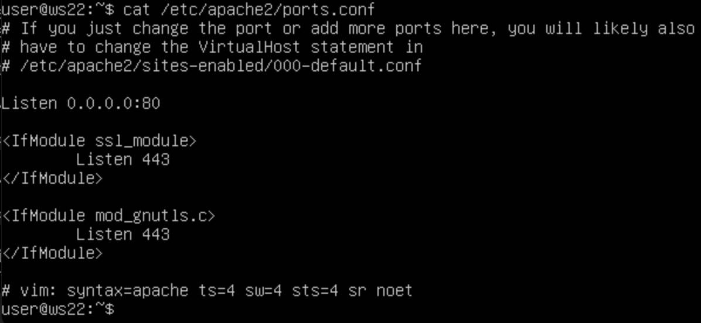
 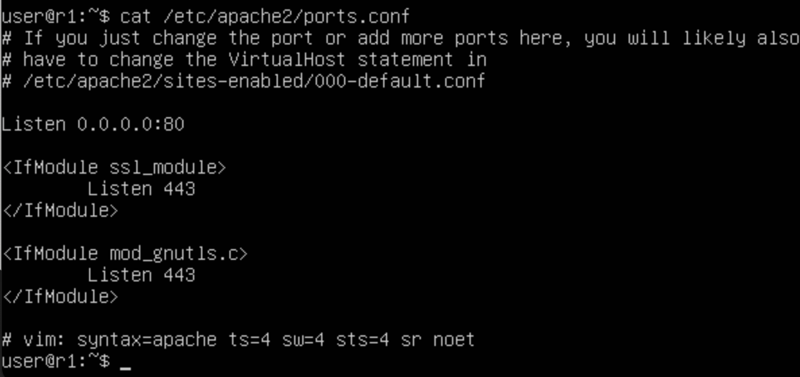

  - Запустил Apache на ws22 и r1:
   sudo service apache2 start
   Комментарий: Сервис на `0.0.0.0:80` должен принимать подключения с любых интерфейсов, что нужно для проверки NAT.

 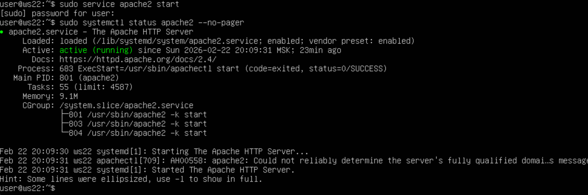
 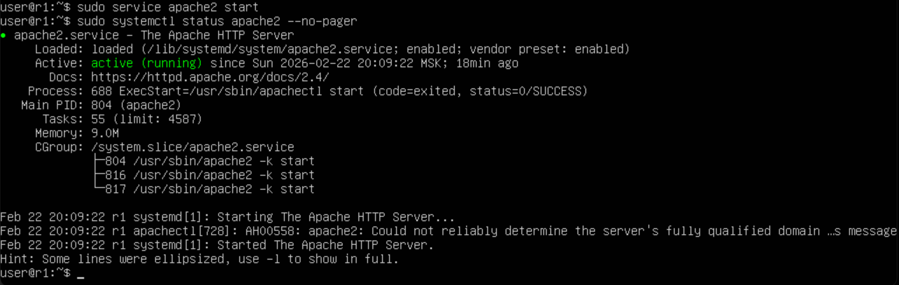

 ### 7.2 Базовые правила firewall на r2

 - Создан файл firewall с правилами:
```bash
#!/bin/bash

# чистим правила в таблице filter
iptables -F
# чистим правила в таблице nat
iptables -F -t nat
# политика по умолчанию: транзитный трафик через роутер запрещён
iptables --policy FORWARD DROP
``` 
 - Запуск:
   sudo chmod +x firewall.sh
   sudo ./firewall.sh
 
  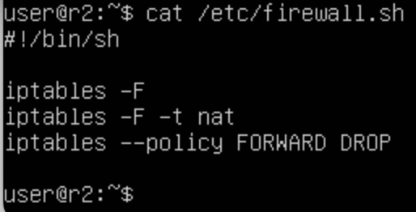
  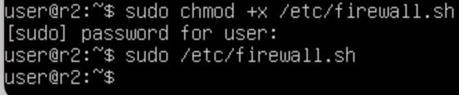


 - Проверка соединения c r1:
   ping 10.20.0.20(ws22)
  
 > **Результат:**  
 > При политике `FORWARD DROP` маршрутизируемые пакеты блокируются.  
 > ws22 не пингуется с r1.
 
  Комментарий: Политика `FORWARD DROP` ломает связь между подсетями, потому что роутер перестаёт пересылать даже разрешённые по локальным правилам пакеты.

 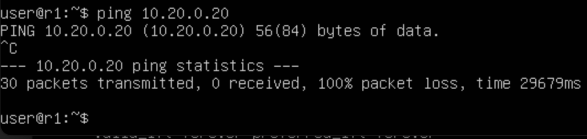

 ### 7.3 Разрешение ICMP

  - Добавлено правило:

```bash
# разрешаем транзит ICMP через r2, чтобы вернуть ping между подсетями
iptables -A FORWARD -p icmp -j ACCEPT
```

 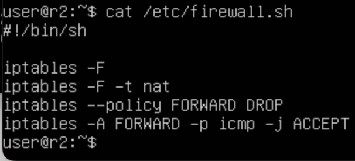

 - После запуска firewall проверка с r1:
   ping 10.20.0.20(ws22)

 > **Результат:**  
 > После разрешения ICMP ws22 успешно пингуется с r1.
 
 Комментарий: Разрешение ICMP именно в `FORWARD` чинит межсетевой ping, не меняя политику локальных цепочек INPUT/OUTPUT.

 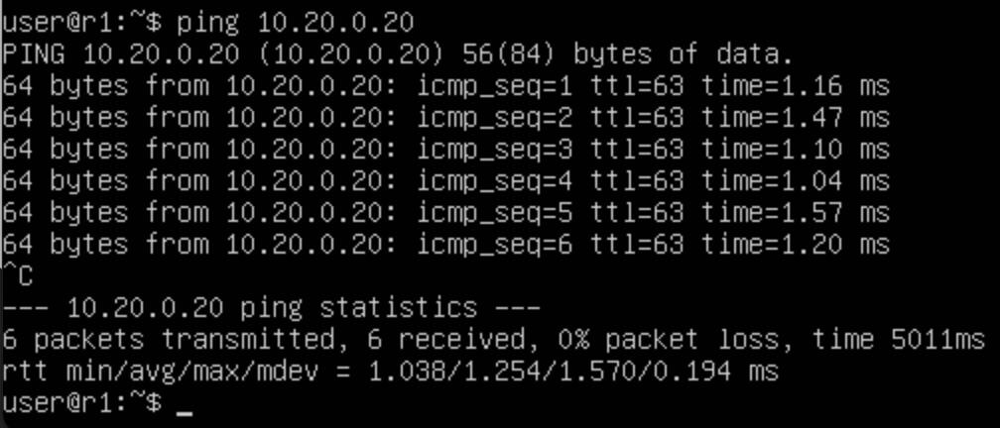

 ### 7.4 Настройка SNAT (маскарадинг)

  - Добавлено правило:

```bash
# POSTROUTING в таблице nat: меняем source-адрес исходящих пакетов подсети за r2
iptables -t nat -A POSTROUTING -s 10.20.0.0/26 -o enp0s2 -j MASQUERADE
# разрешаем новые исходящие соединения из внутренней сети
iptables -A FORWARD -s 10.20.0.0/26 -j ACCEPT
# разрешаем обратный трафик только для уже установленных сессий
iptables -A FORWARD -d 10.20.0.0/26 -m state --state ESTABLISHED,RELATED -j ACCEPT
```

  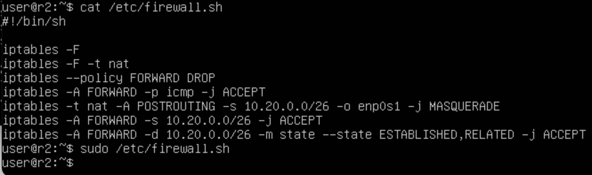

  Это правило:
   - Маскирует локальные IP сети 10.20.0.0/26
   - Позволяет машинам за r2 выходить во внешнюю сеть
  - Комментарий: Связка `SNAT/MASQUERADE + ESTABLISHED,RELATED` нужна, чтобы ответы возвращались только к инициированным соединениям.

  - Проверка TCP-соединения (SNAT):
   С ws22:
   telnet 10.10.0.1 80

 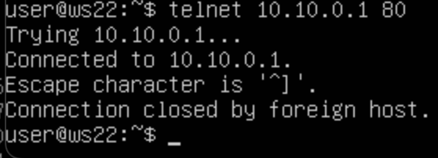

  > **Результат:**  
  > TCP-соединение успешно устанавливается.  
  > SNAT работает корректно.

 ### 7.5 Настройка DNAT

  - Добавлено правило:

```bash
# PREROUTING в nat: меняем destination до маршрутизации, пробрасываем 8080 -> ws22:80
iptables -t nat -A PREROUTING -p tcp --dport 8080 -j DNAT --to-destination 10.20.0.20:80
# в filter/FORWARD отдельно разрешаем транзит до целевого веб-сервера
iptables -A FORWARD -p tcp -d 10.20.0.X --dport 80 -j ACCEPT
```

   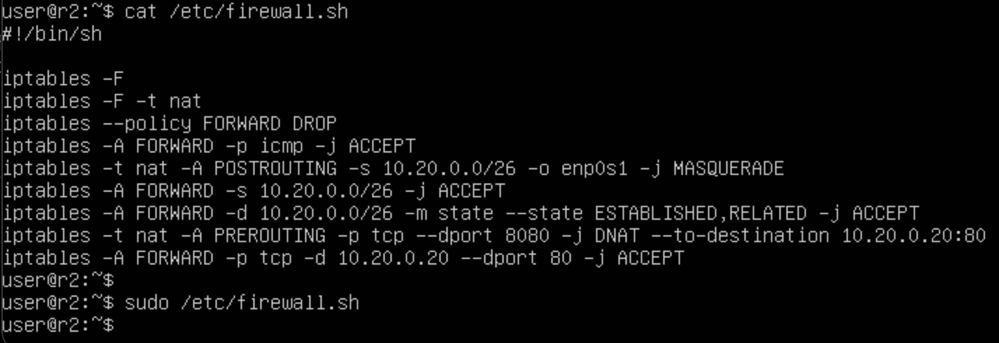

   Это правило:
     - Перенаправляет входящие соединения на r2:8080
     - На веб-сервер Apache, запущенный на ws22 (порт 80)
   - Комментарий: DNAT меняет только destination-адрес/порт, поэтому без разрешения FORWARD пакет всё равно будет отброшен.

  - Проверка TCP-соединения (DNAT):
   С r1:
   telnet 10.100.0.12 8080

  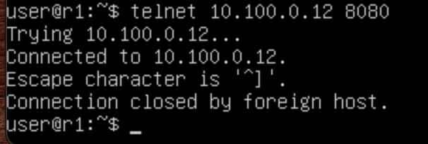

  > **Результат:**  
  > TCP-соединение успешно устанавливается.  
  > DNAT корректно перенаправляет трафик на ws22.

### Итог:
- Подготовлен сервис Apache для проверки прохождения трафика через NAT.
- На r2 очищены таблицы `filter`/`nat` и продемонстрирован эффект `FORWARD DROP`.
- Настроены правила для ICMP, SNAT (MASQUERADE) и DNAT (8080 -> ws22:80).
- Проверками ping/telnet подтверждено, какие цепочки и правила реально влияют на маршрут трафика.

### Типичные поломки:
- Забывают очистить старые правила; проверка: `iptables -L -n -v` и `iptables -t nat -L -n -v`.
- Включают DNAT, но не открывают FORWARD; проверка: нет соединения на ws22:80.
- Неверный выходной интерфейс в MASQUERADE; проверка: `ip a` и счётчики правил.
- Нет `ESTABLISHED,RELATED`, из-за чего ломается обратный трафик; проверка: SYN уходит, ответа нет.

## Part 8. Дополнительно. Знакомство с SSH Tunnels

 - запустил firewall.sh на r2

 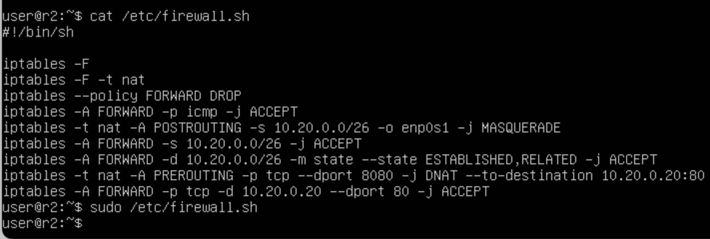

 - на ws22:

  ```bash
  # открытие конфигурации порта Apache для ограничения bind-адреса
  /etc/apache2/ports.conf
  ``` 
  - заменил Listen 0.0.0.0:80 на Listen 127.0.0.1:80
  - sudo service apache2 restart
  - ss -tulnp | grep 80
  - Комментарий: После bind на `127.0.0.1:80` сервис доступен только локально на ws22 и недоступен напрямую из сети.
  
  >tcp слушает 1270.0.0.1:80 и недоступен напрямую из сети.

  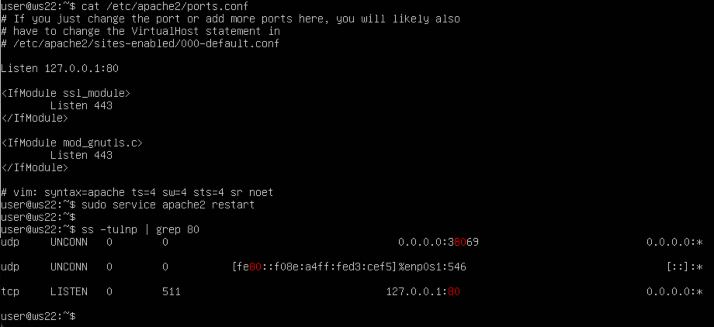
  
 ### Local TCP forwarding
  
  - С машины ws21 выполненил локальное пробрасывание порта:

  ```bash
  # Local forwarding: локальный 8080 на ws21 перенаправляется к 127.0.0.1:80 на ws22 через SSH
  ssh -L 8080:127.0.0.1:80 user@10.20.0.20
  ```

  > **Где:**
  > - 8080 — локальный порт на ws21
  > - 127.0.0.1:80 — Apache на ws22
  > - 10.20.0.20 — IP ws22

 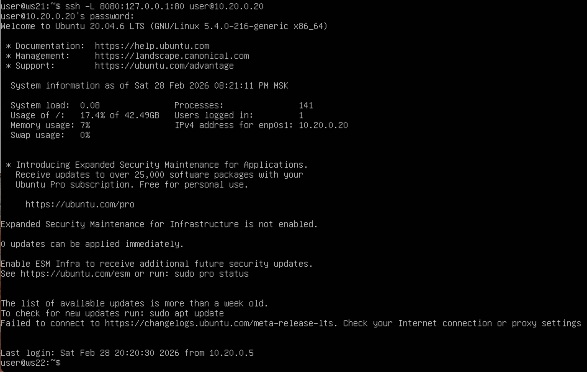

  - Во втором терминале ws21 выполненил проверку:
  
  ```bash
  # обращаемся к локальному порту, который SSH прозрачно проксирует на удалённый localhost:80
  telnet 127.0.0.1 8080
  ```
  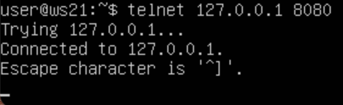

  >TCP-соединение успешно устанавливается.
  >Доступ к Apache на ws22 получен через SSH-туннель.
  
  Комментарий: Это работает даже при bind сервиса на localhost, потому что подключение завершается на ws22 внутри SSH-сессии.

 ### Remote TCP forwarding

  - С машины ws22 выполненил удалённое пробрасывание порта:

  ```bash
  # Remote forwarding: порт 9090 на ws11 проксируется к 127.0.0.1:80 на ws22 через SSH
  ssh -R 9090:127.0.0.1:80 user@10.10.0.2
  ```

  > **Где:**
  > - 9090 — порт, открываемый на ws11
  > - 127.0.0.1:80 — Apache на ws22
  > - 10.10.0.2 — IP ws11

 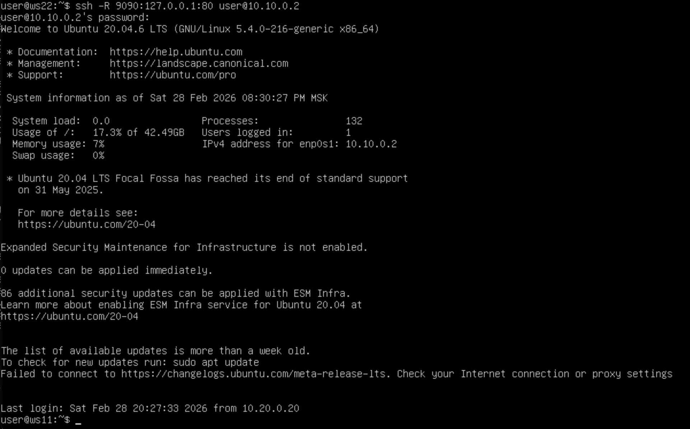

  - Во втором терминале ws11 выполненил проверку:
  
  ```bash
  # проверяем доступ к удалённо опубликованному порту на локальном loopback ws11
  telnet 127.0.0.1 9090
  ```
  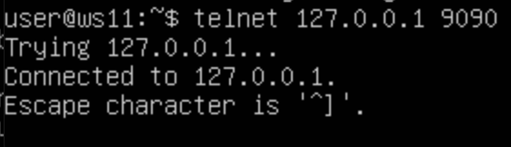

  >TCP-соединение успешно устанавливается.
  >Доступ к Apache на ws22 получен через Remote SSH Tunnel.

### Итог:
- Сервис Apache на ws22 переведён в режим прослушивания только `127.0.0.1:80`.
- Проверен Local TCP forwarding (`ssh -L`): локальный порт клиента проксируется в удалённый localhost:80.
- Проверен Remote TCP forwarding (`ssh -R`): удалённый порт на ws11 публикует сервис ws22.
- Через `telnet 127.0.0.1:<port>` подтверждена работоспособность обоих типов SSH-туннелей.

### Типичные поломки:
- Туннель не поднимается из-за SSH-доступа/аутентификации; проверка: лог ssh в терминале.
- Неверно перепутаны локальный и удалённый порты в `-L/-R`; проверка: сверить схему `порт -> хост:порт`.
- Сервис на целевом localhost не слушает порт 80; проверка: `ss -tulnp | grep 80`.
- Проверка идёт не на `127.0.0.1` нужной машины; проверка: выполнять telnet на стороне, где открыт туннельный порт.

## Сводка команд
- `ipcalc`
- `ip a`
- `ip r`
- `netplan apply`
- `iperf3`
- `iptables`
- `nmap`
- `sysctl`
- `tcpdump`
- `traceroute`
- `systemctl`
- `dhclient`
- `telnet`
- `ssh -L`
- `ssh -R`
