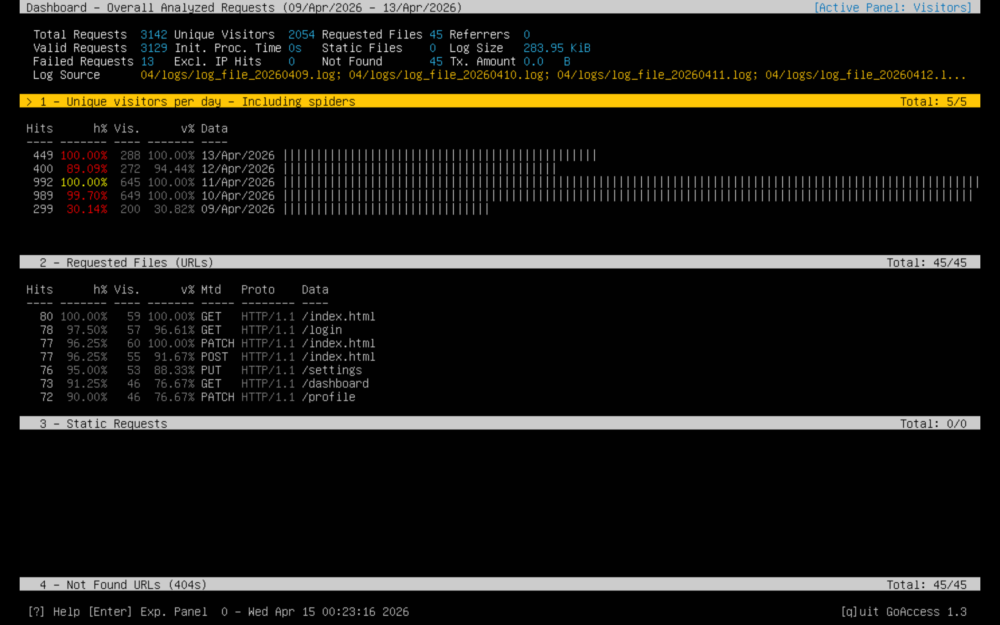
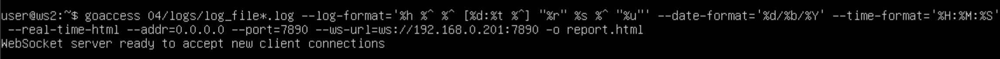

## 1. Установка GoAccess.

  - sudo apt update
  - sudo apt install goaccess
  - goaccess --version (проверил установку)

## 2. Запуск GoAccess на машине.

 

## 3. Подбор формата и вывод информации.

 - Подобрал формат, запустил сервер и сохранил html&

 ```bash
   goaccess 04/logs/log_file*.log \
   --log-format='%h %^ %^ [%d:%t %^] "%r" %s %^ "%u"' \
   --date-format='%d/%b/%Y' \
   --time-format='%H:%M:%S' \
   --real-time-html \
   --addr=0.0.0.0 \
   --port=7890 \
   -o report.html
 ```

 

 - В браузере открыл веб-интерфейс.

 
 
