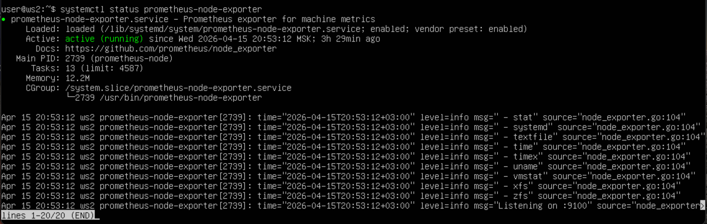
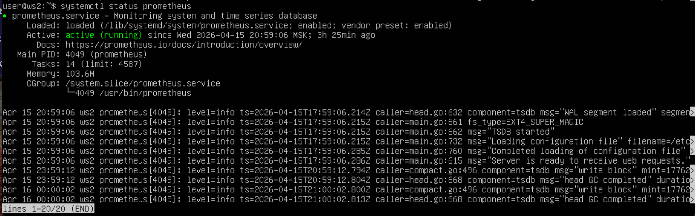
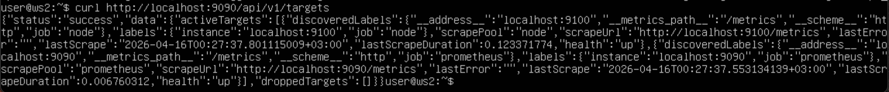
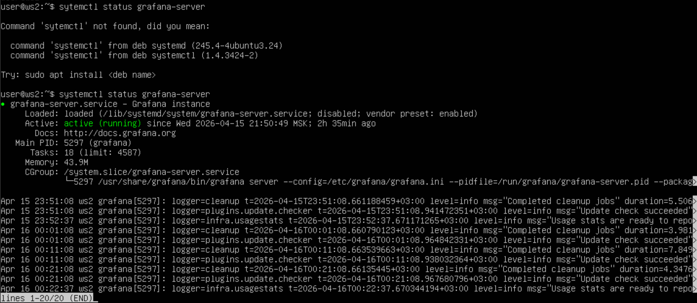
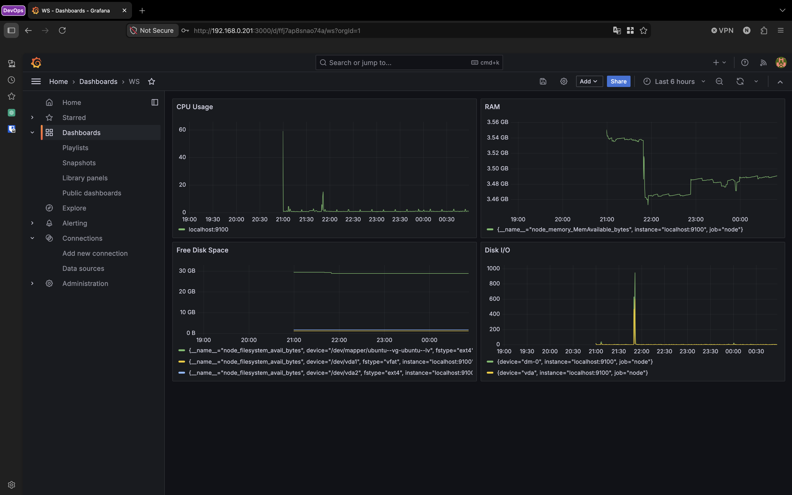
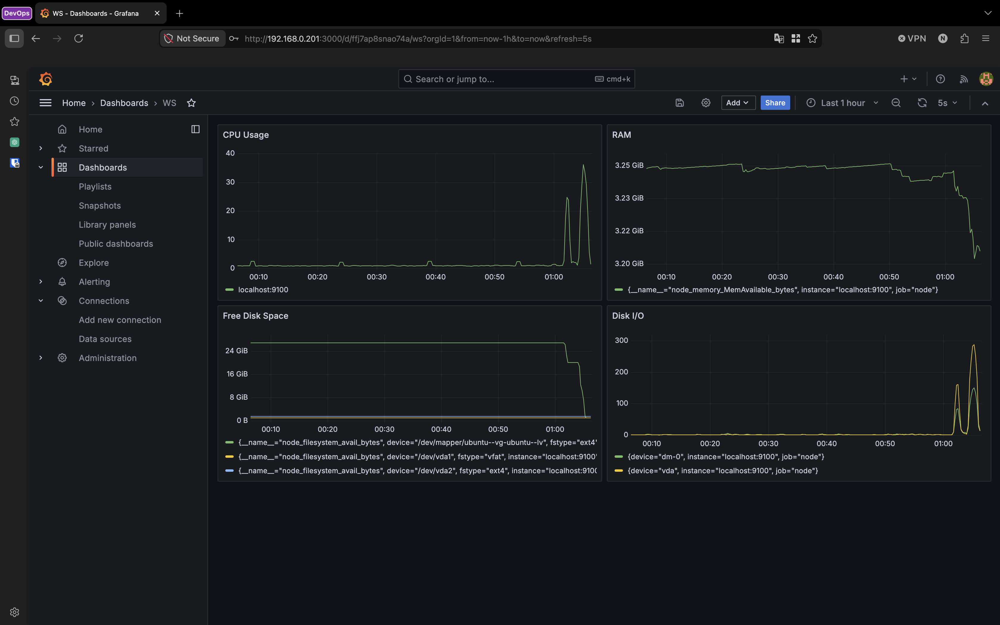
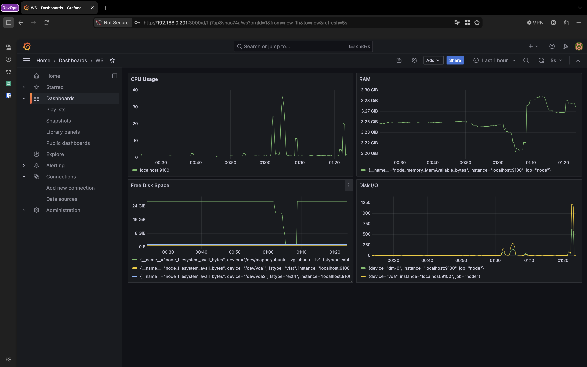

## 1. Установка программ.

 - sudo apt install prometheus-node-exporter
 - systemctl status prometheus-node-exporter

 

 - sudo apt install prometheus
 - systemctl status prometheus

 

 - curl http://localhost:9090/api/v1/targets

 

  > - localhost:9100 - есть
  > - health: up - есть
  > 
  > **Итог:** Prometheus видит Node Exporter

 - wget https://dl.grafana.com/oss/release/grafana_10.4.2_amd64.deb
 - sudo dpkg -i grafana_10.4.2_amd64.deb
 - sudo systemctl enable grafana-server
 - sudo systemctl start grafana-server
 - systemctl status grafana-server

 

## 2. Запуск Grafana в браузере и тесты.

 - http://192.168.0.201:3000
 
 - Добавил Dashboard и добавил в него панели CPU, RAM, Free Disk space, Disk I/0.

 

 - Запустил скрипт из Part 2.

 

 > **Результат:** После запуска скрипта поднялась загруженность CPU, DISK I/O, уменьшились показатели свободного места в RAM и Disk space.

 - Установил утилиту stress на машину командой 
     ```bash
     sudo apt install stress
     ```
 
 - Запустил утилиту командой 
     ```bash
     stress -c 2 -i 1 -m 1 --vm-bytes 32M -t 10s
     ```
 
 

 > **Результат:** После запуска утилиты поднялись показатели загружености CPU и Disk I/O

 