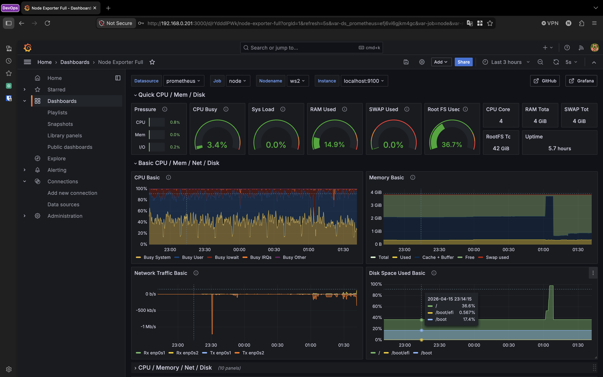
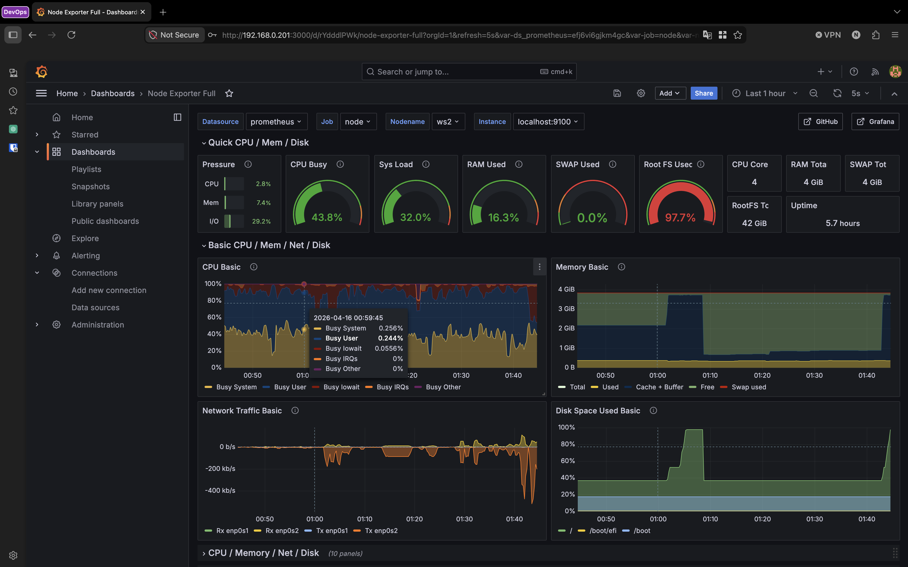
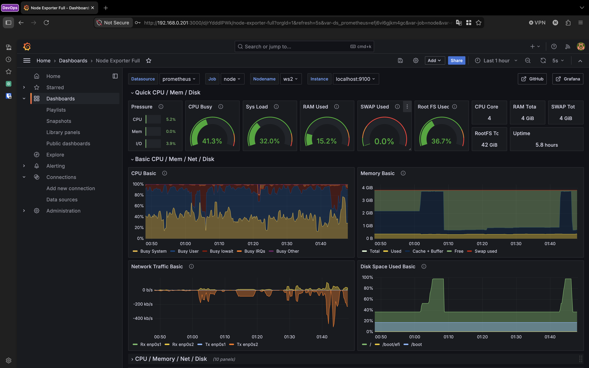
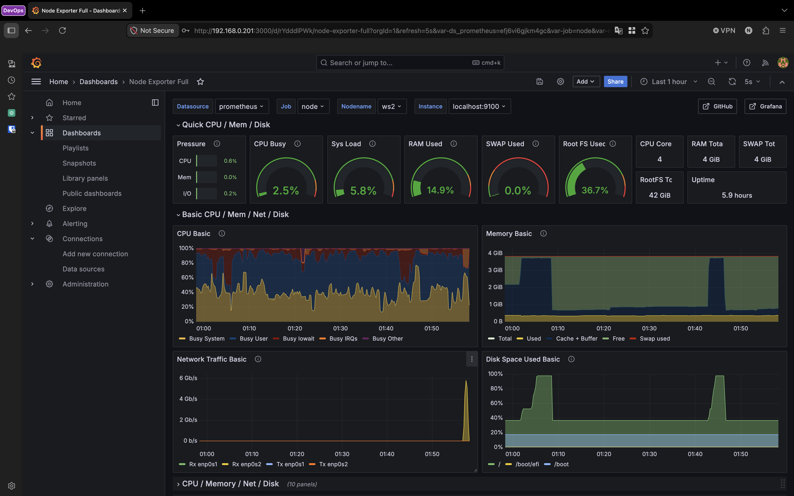

## 1. Добавление нового готового Dashboard

  - Перешел во вкладку "Dashboards"
  - Нажал кнопку "New" и выбрал "Import"
  - Далее ввел ID дашборда "1860", нажал "Load" и в следующем окне нажал "Import"
  - Открылся импортированный дашборд.

  

## 2. Проведения тестов из Part 7.

  - Запустил скрипт из Part 2.

 

 > **Результат:** После запуска скрипта поднялась загруженность CPU, DISK I/O, уменьшились показатели свободного места в RAM и Disk space.

 - Установил утилиту stress на машину командой 
     ```bash
     sudo apt install stress
     ```
 
 - Запустил утилиту командой 
     ```bash
     stress -c 2 -i 1 -m 1 --vm-bytes 32M -t 10s
     ```
 
 

 > **Результат:** После запуска утилиты поднялись показатели загружености CPU и Disk I/O

 - На ws1 запустил iperf3 -s
 - На ws2 запустил iperf3 -с 192.168.0.201 -t 30

 

 > **Результат:** После запуска утилиты поднялись показатели Network Traffic на enp0s2.