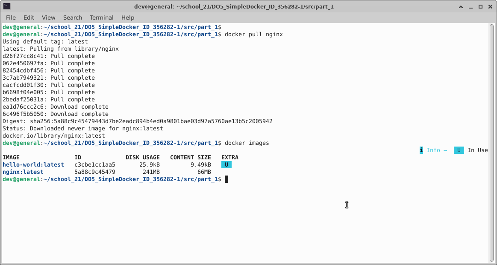

## Part 1: Готовый Докер

  - **Загрузил готовый образ nginx**
  - **Вывел список образов**

  

  - **Запустил контейнер в фоновом режиме, дав ему имя "my_nginx"**
  - **Вывел список запущенных контейнеров**
  - **Вывел информацию по контейнеру "my_nginx"**

  
  
  
  
  

  > - **IP-адрес:** 172.17.0.2
  > - **Port:** "Ports": {"80/tcp": "null"}
  >
  > Так так `docker inspect my_nginx` не вывел размер контейнера, вывел его с помощью `docker ps -s`:
  > - **Размер контейнера:** 81.9kb

  

  - **Остановил контейнер "my_nginx"**
  - **Проверил, что процес остановился**
  
  

  - **Запустил докер контейнер "my_nginx_mapped" с портами 80 и 443**

  

  - **Открыл браузер и перешел по адресу `https://localhost:80`**

  

  - **Выполнил рестарт контейнер**

  


## Part 2: Операции с контейнером

 - **Проверил работает ли контейнер**
 - **Нашел путь к файлу "nginx.config", через `docker exec ... find -name "nginx.config"`**
 - **По найденому пути прочитал файл с помощью `docker exec ... cat ./etc/nginx/nginx.config`**

 

 - **Вернулся к корневой директории**
 - **Через `nano` локально создал файл "nginx.config" и прописал конфигурацию(вывел на скриншоте)** 

 

 - **С помощью `docker cp` скопировал конфигурационный файл в контейнер**
 - **С помощью `docker exec ... -s reload` перезапустил nginx**
   >`-s reload` - перезапуск конфигурации без остановки сервера

 

 - **Открыл браузер и перешел на `https://localhost:80/status`**
   >Страница вывела:
   > - 1 активное соединение
   > - 4 - принятые соединения, 4 - успешные соединения, 5 - всего запросов
   > - 0 - соединений читают заголовки, 1 - соединение отправляет ответ клиенту, 0 - соединений ожидают новых запросов

 

 - **Экспортировал контейнер в архив `container.tar`(Скриншот отсутствует):**
   ```bash
   docker export -o container.tar my_nginx_mapped
   ```
 - **Остановил контайнер(Скриншот отсутствует):**
   ```bash
   docker stop my_nginx_mapped
   ```

 - **Удалил образ `nginx` через `docker rmi`(Скриншот отсутствует):**
   ```bash
   docker rmi -f nginx
   ```
     >`-f` - принудительно удалить образ игнорируя ссылки на контейнер

 - **Удалил остановленный контейнер(Скриншот отсутствует):**
   ```bash
   docker rm my_nginx_mapped
   ```

 - **Создал образ из архива `container.tar`, с помощью `docker import`**
 - **Создал и запустил контейнер из созданного образа `my_nginx_imported`**
   > - `-d` - запуск в фоне
   > - `--name` - задать имя
   > - `-p` - проброс портов
   > - `nginx -g "daemon off;"` - запуск без демонстрации

 

 - **Открыл браузер и перешел на `https://localhost:80/status`**
   >Страница вывела:
   > - 1 активное соединение
   > - 2 - принятые соединения, 2 - успешные соединения, 1 - всего запросов
   > - 0 - соединений читают заголовки, 1 - соединение отправляет ответ клиенту, 0 - соединений ожидают новых запросов

 
 
## Part 3. Мини веб-сервер

  - **Установил необходимые пакеты `gcc`, `libfcgi-dev`, `spawn-fcgi`, `nginx`**
  - **С помощью nano создал файл server.c и прописал в нем код, который выводит `Hello world!`**
  - **Скомпилировал server**
    >`-lfcgi` - подключает библиотеку "lifcgi"
  - **Запустил сервер через spawn-fcgi**
    >- `-p 8080` - задает порт 8080
    >- `-n` - не создает дочерних процессов и не завершает родительских, оставаясь в текущем терминале, а `&` в конце запускает в фоне
  - **Проверил, что процесс запустился и слушает порт 8080 с помощью `ss -tulpn`**

 

  - **Создал в корне папку `nginx`**
  - **С помощью nano в папке создал конфигурационный файл `nginx.config`**
  - **Остановил `nginx`**
  - **Запустил проверку конфирационного файла и получил сообщени, что все успешно**
  - **Запустил `nginx`**

  

  - **Открыл браузер и перешел на `http://localhost:81`**

  

## Part 4. Свой докер

 - **Создал `Dockerfile` в корне репозитория с помощью `nano` и прописал команды**

 

 - **Собрал образ из `Dockerfile`, все прошло успешно, проверил что образ появился в списке**
 - **Запустил контейнер из образа, смонтировав файл `./nginx/nginx.conf` с хоста в контейнер `etc/nginx/nginx.conf`**
   >`-v $(pwd)/nginx/nginx.conf:etc/nginx/nginx.conf` - монтирует файл с хоста в контейнер, для того чтобы не пересобирать образ каждый раз как изменяется файл.

 
 
 - **Открыл браузер и перешел на `http://localhost:80`, чтобы проверить что `nginx` работает**

 

 - **Изменил конфиг `nginx` в хосте**
 - **Перезапустил контейнер**

 

 - **Перешел на `http://localhost/status`, чтобы проверить что измения отобразились в контейнере**  

 


## Part 5. Dockle

 - **Установил Dockle**

 

 - **Проверил что образ существует**
 - **Запустил проверку своего образа `my_server_image:latest`**

 >**Результаты проверки `Dockle`:**
 > - `CIS-DI-0010` - Контейнер содержит ключ учетных данных в переменной контейнера.
 > - `CIS-DI-0001` - Не запускать, контейнер от root. Создать пользователя для контейнера. 
 > - `DLK-DI-0006` - Избегать `:latest`, чтобы не несовместимости и версия была зафиксирована.
 > - `CIS-DI-0005` - Доверять содержимому Docker.
 > - `CIS-DI-0006` - Добавить инструкцию HEALTHCHECK. Проверка работоспособности приложения в контейнере.
 > - `CIS-DI-0008` - Подтвердить безопасность setuid/setgid файлов. Часто дают программам выполняться с правами владельца.

 
 
 - **С помощью `nano` изменил конфиг `Dockerfile`**
 - **Собрал образ из конфига, образ собрался успешно**

 

 - **Запустил проверку `Dockle` после изменений с флагом игнорирования `CIS-DI-0010`, потому что это готовый скачаный nginx и он содержит ключи**
 
 

 - **Остались только 2 необязательных предупреждения**

## Part 6. Базовый Docker Compose

 - **Создал директорию и прописал конфиг для прокси-сервера nginx**

 

 - **Создал конфигурационный файл docker-compose.yml**

 

 - **Изменил Dockerfile**

 

 - **Собрал образы и и запустил контейнеры**

 

 - **Проверил запустились ли контейнеры и проверил что все работает**

 
